[](https://github.com/api7/aisix/actions/workflows/build.yaml)
[](https://github.com/api7/aisix/blob/main/LICENSE)

<p align="center">
  
</p>

<p align="center">
  <strong>An open source, high-performance AI Gateway and LLM proxy built in Rust.</strong><br/>
  <em>Unified OpenAI-compatible API for OpenAI, Anthropic, Gemini, DeepSeek, and any OpenAI-compatible provider.</em><br/><br/>
  🦀 <strong>Rust</strong> • 🔌 <strong>OpenAI Compatible</strong> • 🗄️ <strong>etcd</strong>
</p>


## Why Teams Use AISIX as Their Enterprise AI Gateway

- 🦀 **Rust + Tokio** — Extreme performance with low resource footprint; ships as a single binary
- 🔌 **OpenAI-Compatible** — One API to call all LLMs; drop-in replacement with zero code changes
- ⚡ **Dynamic Config** — Hot-reload via etcd; update models and keys without restarting
- 🛡️ **Enterprise-Grade Control** — API key auth, rate limiting (RPM / TPM / concurrent), and per-model access control
- 📊 **Observability** — OpenTelemetry distributed tracing and Prometheus metrics out of the box
- 🎨 **Admin UI** — Built-in management dashboard for models, API keys, and a chat playground

---

## Features

### 🌐 Multi-Provider Support

| Provider | Chat Completions | Streaming | Embeddings |
|---|:---:|:---:|:---:|
| 🟢 OpenAI | ✅ | ✅ | ✅ |
| 🟠 Anthropic | ✅ | ✅ | — |
| 🔵 Gemini | ✅ | ✅ | ✅ |
| 🐋 DeepSeek | ✅ | ✅ | — |
| 🔌 OpenAI-Compatible | ✅ | ✅ | ✅ |

### 🚦 Traffic Management

- Rate limiting — RPM, RPD, TPM, TPD, and concurrent request limits
- Per-model and per-key access control
- Request validation with JSON Schema

### 🛡️ Security & Auth

- API key authentication on all proxy requests
- Per-key model allowlist
- Admin API key protection

### 📊 Observability

- OpenTelemetry distributed tracing (Jaeger / Zipkin)
- Prometheus metrics export
- Structured logging via [`logforth`](https://crates.io/crates/logforth)

### 🎨 Admin & Management

- RESTful Admin API with OpenAPI spec + Scalar UI
- React-based Admin Dashboard
- Model CRUD / API Key CRUD / Chat Playground
- etcd-backed dynamic configuration (no restarts needed)

---

## Architecture

<a href="#architecture"></a>

---

## Quick Start

```bash
curl -fsSL https://run.api7.ai/aisix/quickstart | sh
```

This script downloads configuration files, generates a random Admin Key, and starts AISIX with etcd via Docker Compose. Once running:

- Proxy API: `http://127.0.0.1:3000`
- Admin API: `http://127.0.0.1:3001/aisix/admin`
- Admin UI: `http://127.0.0.1:3001/ui`

For the full setup guide including model configuration and making your first request, see the [Quick Start documentation](docs/getting-started/quick-start.md).

---

## Development

See [CONTRIBUTING.md](CONTRIBUTING.md) for the full contribution guide including branching, code style, and PR expectations.

### Prerequisites

- [Rust](https://rustup.rs/) (latest stable)
- [Node.js](https://nodejs.org/) LTS + [pnpm](https://pnpm.io/) (`corepack enable pnpm`)
- [Docker](https://docs.docker.com/get-docker/) & Docker Compose (for etcd and the test environment)
- `protobuf-compiler` — `sudo apt install protobuf-compiler` (Debian/Ubuntu) or `brew install protobuf` (macOS)

### Build & Run

1. Build UI

    ```bash
    cd ui
    pnpm install --frozen-lockfile
    pnpm build

    ## Or if you don't want to, then create a stub folder.
    ## Run this command in the root directory of the project.
    mkdir -p ui/dist
    ```

2. Build gateway

    ```bash
    cargo run
    ```

## Roadmap

- [ ] Guardrails: content filtering and safety checks
- [ ] Load Balancing / Fallback: across providers
- [ ] Cost tracking & usage analytics
- [ ] Semantic caching: cache responses based on query intent, not exact match
- [ ] More providers: Azure, Bedrock, Ollama...
- [ ] Kubernetes Helm chart
- [ ] New protocol support
    - [ ] OpenAI Responses API
    - [ ] Anthropic Messages API
    - [ ] Google Gemini GenerateContent API
- [ ] Multimodal APIs: Image, audio, video
- [ ] MCP proxy

## Community

- Contribute via [CONTRIBUTING.md](CONTRIBUTING.md) — setup, code style, and PR guidelines
- Join our [Discord server](https://discord.gg/mAZzcRtP) for real-time chat with the community and maintainers
- Use [GitHub Discussions](https://github.com/api7/aisix/discussions) for questions, ideas, and architecture discussions
- Use [GitHub Issues](https://github.com/api7/aisix/issues) for bug reports, feature requests, and actionable tasks
- Follow repository activity for ongoing documentation and product updates

---

## License

This project is licensed under the [Apache License 2.0](LICENSE).
