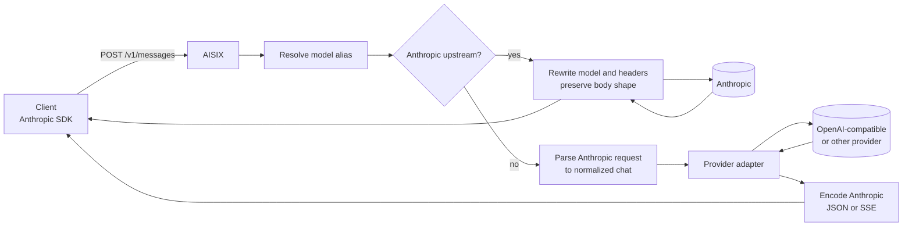

AISIX AI Gateway can route an Anthropic Messages request sent to
`POST /v1/messages` to different upstream provider families. The gateway chooses one of two runtime paths:

- **Anthropic upstreams use byte passthrough.** AISIX rewrites the model
  and upstream headers, then keeps the Anthropic request and response
  shape as close to the provider wire format as possible.
- **Non-Anthropic upstreams use protocol translation.** AISIX maps the
  Anthropic request into a normalized chat representation, dispatches it
  through the selected provider adapter, and encodes the response back as
  Anthropic JSON or Anthropic SSE.

Both paths share API-key authentication, model resolution, logging,
metrics labels, health tracking, and rate-limit enforcement.

## What to expect

- **Provider choice affects fidelity.** Routing Anthropic Messages
  traffic to an Anthropic upstream preserves Anthropic-specific fields
  better than cross-provider translation can.
- **The caller-facing model name is preserved.** Cross-provider
  responses use the gateway model alias the caller sent, not the raw
  upstream model id.
- **Streaming remains Anthropic-shaped.** When a non-Anthropic upstream
  streams provider-native chunks, AISIX emits Anthropic SSE events such
  as `message_start`, `content_block_delta`, `message_delta`, and
  `message_stop`.
- **Caller credentials are not forwarded upstream.** AISIX injects the
  configured provider key for the selected upstream and bounds which
  response headers are sent back to the client.

## How the request path works

The branch happens after AISIX resolves the requested model alias. If the
resolved upstream provider is Anthropic, the request follows the
passthrough path. Otherwise, the request follows the translation path.

## Anthropic passthrough path

When the upstream is Anthropic, AISIX avoids unnecessary parsing of the
provider response. This preserves fields that are hard to round-trip
through a generic chat representation, including:

- `cache_control` prompt-caching markers
- `thinking` content blocks
- Anthropic-native tool and image content blocks
- request fields such as `metadata`, `top_k`, and `stop_sequences`

AISIX still performs gateway responsibilities before forwarding the
request:

1. Resolve the caller-facing model alias to the upstream Anthropic model.
2. Replace the request `model` value with the upstream model id.
3. Inject Anthropic headers such as `x-api-key`,
   `anthropic-version`, `content-type`, and `x-aisix-request-id`.
4. Preserve the response shape for the caller.

For streaming responses, AISIX forwards the Anthropic event stream
without re-emitting every event through a separate SSE encoder. For
non-streaming responses, AISIX can inspect the response body for usage
fields such as `usage.input_tokens` and `usage.output_tokens`.

## Cross-provider translation path

When an Anthropic Messages request targets a non-Anthropic upstream,
AISIX translates the request and response:

1. Parse the Anthropic request into a normalized chat representation.
2. Dispatch the request through the selected provider adapter.
3. Convert the upstream response back to Anthropic JSON or Anthropic SSE.
4. Preserve the gateway model alias in the response.

The inbound parser handles the main structural differences between
Anthropic and OpenAI-compatible chat shapes:

- Anthropic `system` content is folded into a system message where the
  target provider expects one.
- Anthropic tool definitions and `tool_use` blocks are translated to the
  tool-call structure used by the target adapter.
- Anthropic `tool_choice` values are mapped to the closest supported
  target-provider values.

For streaming responses, AISIX builds Anthropic SSE framing from the
upstream stream. A client using the Anthropic SDK should still see the
expected event sequence even when the upstream provider is not
Anthropic.

## Fidelity boundaries

Cross-provider translation is useful when applications want one
Anthropic-shaped client contract while the platform team routes traffic
to different upstream providers. It is not a promise that every
Anthropic-only feature can be represented by every upstream.

Prefer an Anthropic upstream when the application depends on
Anthropic-specific request or response fields. Use cross-provider
translation when the application depends on the broader message, tool,
and streaming shape rather than provider-specific extensions.

## Next steps

- [Anthropic Messages](/ai-gateway/integration/anthropic-messages)
  explains the caller-facing `/v1/messages` API.
- [OpenAI-compatible API](/ai-gateway/integration/openai-compatible-api)
  explains the main OpenAI-compatible request path.
- [Adapter protocol families](/ai-gateway/reference/adapters) compares
  the provider adapter families AISIX can dispatch through.
