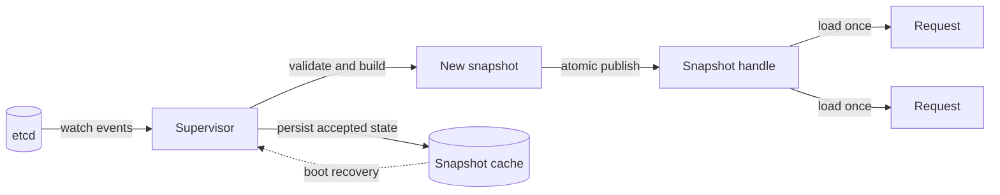
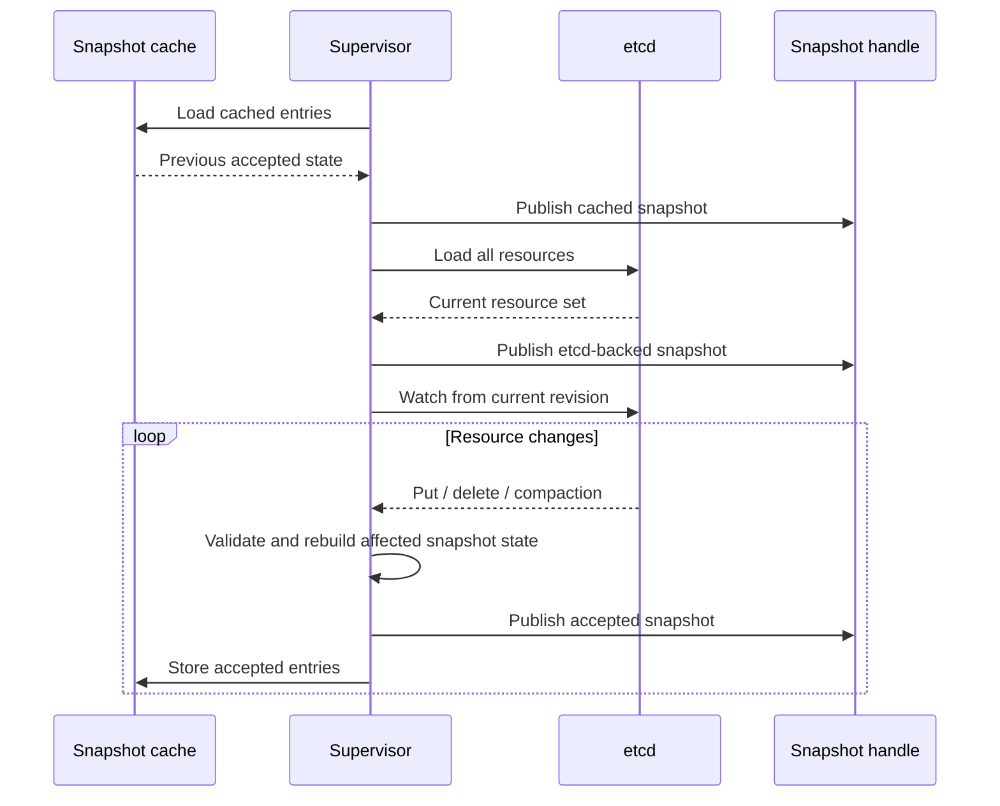

AISIX AI Gateway stores dynamic resources such as models, API keys,
provider keys, guardrails, cache policies, and rate-limit policies in
etcd. Proxy instances need those resources for every AI request, but
they do not call etcd on the request path.

Each proxy keeps a local immutable snapshot of the latest accepted
configuration. A background supervisor watches etcd, validates updates,
and atomically publishes a new snapshot when resources change. Request
handlers load the current snapshot once, then use that same consistent
view for the lifetime of the request.

## What to expect

- **Configuration propagation is asynchronous.** An admin write is
  accepted after the control plane persists it. Each proxy applies the
  change after receiving and validating the next watch event.
- **Requests do not wait on etcd.** The request path reads from a local
  snapshot, not from the backing configuration store.
- **Invalid resources do not replace valid config.** A rejected resource
  is reported through heartbeat state, while the proxy keeps serving the
  last valid snapshot.
- **Each proxy watches independently.** In multi-replica deployments,
  different proxy instances can briefly serve different accepted
  revisions.

## How propagation works

The propagation path has three parts:

- **Supervisor** watches etcd, loads resources, validates changes, and
  publishes accepted snapshots.
- **Snapshot handle** exposes the current immutable snapshot to request
  handlers and admin reads.
- **Snapshot cache** stores accepted entries on disk so a managed data
  plane can recover from a previous accepted state while reconnecting.

The request path is intentionally small: a handler loads the snapshot,
looks up the requested model, follows references such as provider keys
and policies, then forwards the request using that one view. If a newer
snapshot is published while the request is in flight, that request keeps
using the view it already loaded.

## How requests read configuration

The proxy loads the snapshot at the beginning of request handling. From
that point on, the request uses a single immutable snapshot.

This matters for referenced resources. For example, a model can point to
a provider key, rate-limit policy, cache policy, and guardrail policy.
The request should not see the model from one revision and the provider
key from another revision. Holding one snapshot for the full request
keeps those lookups consistent.

The implementation uses an atomic snapshot handle backed by `ArcSwap`,
so reads do not block while the supervisor publishes a newer snapshot.
The trade-off is that an old snapshot can stay in memory until the last
request using it finishes.

## How the supervisor publishes updates

The supervisor owns configuration updates. On startup, it can replay the
snapshot cache, then connects to etcd, loads the full resource set, and
starts watching for updates.

For a resource update, the supervisor validates the new entry before it
can enter the live snapshot. For a delete, it removes the entry from the
next published snapshot. If the etcd watch is compacted, the supervisor
performs a full resync.

## Why AISIX uses copy-on-write snapshots

AISIX publishes new snapshots instead of mutating the current snapshot in
place. Copy-on-write keeps request reads simple and safe:

- readers do not take a global configuration lock
- a request cannot observe half-applied configuration
- a failed validation cannot partially modify live state
- the old snapshot remains available to in-flight requests

Most resource entries are shared by reference between old and new
snapshots. Publishing a new snapshot therefore does not duplicate every
model, key, or policy payload on every update.

## Failure and recovery behavior

If etcd is temporarily unavailable, an already-running proxy continues
serving from its current snapshot. On restart, a proxy can replay the
snapshot cache before the etcd connection is fully restored.

Operators should still treat the cache as a resilience mechanism, not as
a replacement for etcd. New configuration changes, deletes, validation
state, and fleet-wide convergence still depend on restoring the watch
connection.

## When to check this behavior

When configuration does not appear to take effect:

1. Confirm the admin write succeeded.
2. Check proxy health and heartbeat state for rejected resources.
3. Verify the target proxy instance has reconnected to the configuration
   source.
4. If multiple proxy instances are running, test more than one instance
   or wait for the fleet to converge.

## Next steps

- [Configuration propagation](/ai-gateway/configuration/configuration-propagation)
  explains the user-visible propagation model.
- [Health checks](/ai-gateway/operations/health-checks) explains how to
  verify proxy readiness.
- [Offline resilience](/ai-gateway/cloud/offline-resilience) explains
  the managed data-plane behavior during temporary control-plane loss.
