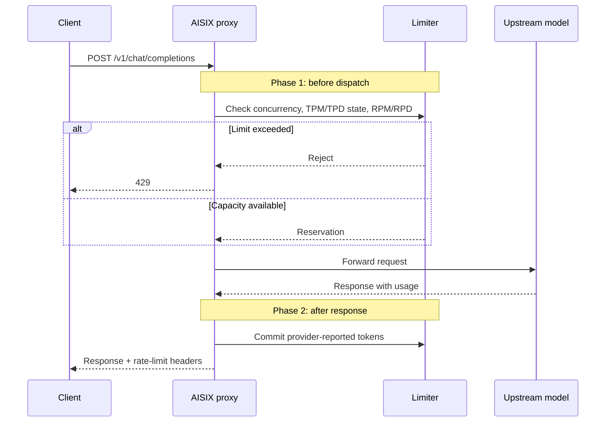

LLM rate limiting is different from most REST API rate limiting because
different costs become known at different times.

- **Requests per minute and requests per day (RPM / RPD)** are known
  before dispatch. Every accepted request consumes one request slot.
- **Tokens per minute and tokens per day (TPM / TPD)** are known only
  after dispatch, when the upstream provider returns usage data.
- **Concurrency** is independent of both request and token counters. It
  limits how many requests can be in flight at the same time.

AISIX AI Gateway uses a two-phase reservation pattern. Phase 1 runs
before the upstream call and reserves request and concurrency capacity.
Phase 2 runs after the upstream returns and records token usage from the
provider response.

## What to expect

- **Request limits are charged before dispatch.** A request that reaches
  the upstream consumes an RPM/RPD slot even if the upstream later fails.
- **Token limits use provider-reported usage.** AISIX does not estimate
  prompt or completion tokens before dispatch.
- **A large response can push a token bucket over the cap.** Because the
  token count arrives after the response, the next request is rejected.
- **Counters are per proxy instance.** In multi-replica deployments,
  each proxy tracks its own in-process counters unless an external
  traffic strategy accounts for the replica count.

## Request lifecycle

Phase 1 creates a reservation. The reservation holds the concurrency
slot and records which request counters have already been charged. When
the response completes, phase 2 commits token usage and releases the
concurrency slot. If the request fails before phase 2, the reservation
still releases the concurrency slot when it is dropped.

## How each limit is enforced

Concurrency is checked and reserved before the upstream request. AISIX
rejects the request when the in-flight count is already at the cap. The
reservation releases the concurrency slot after the response completes or
when the reservation is dropped.

RPM is checked and updated before the upstream request. Every dispatched
request consumes one RPM slot.

RPD is also checked and updated before the upstream request. If RPD fails
after RPM was incremented, AISIX compensates the RPM increment.

TPM is checked before the upstream request only to determine whether the
current token window is already over the cap. AISIX adds token usage
after the upstream response returns provider-reported usage.

TPD follows the same two-phase token pattern. AISIX checks the current
daily token window before dispatch and adds provider-reported token usage
after the upstream response.

This design avoids local token estimation. Provider tokenizers differ,
reasoning models can add hidden reasoning tokens, and tool outputs can
change completion size. The provider usage block is the authoritative
source.

## Fixed-window counters

AISIX uses fixed windows for RPM, RPD, TPM, and TPD:

- RPM and TPM use a 60-second window.
- RPD and TPD use a 24-hour window.
- A window rolls when the current time moves into the next bucket.

Fixed windows can allow a burst near a boundary. For example, traffic can
arrive at the end of one minute and again at the start of the next. AISIX
accepts that behavior in exchange for small, predictable, constant-time
counter operations.

When a request-limit bucket is full, AISIX returns `429` with a
`Retry-After` value based on the end of the current window. Concurrency
rejections do not have a predictable window boundary, so they do not use
the same retry hint.

## Multi-replica behavior

Rate-limit counters are stored in process memory. If you run three proxy
instances with an RPM cap of `60`, each instance can accept up to `60`
requests per minute for the same key. A load balancer that spreads
traffic evenly can therefore allow up to roughly `180` requests per
minute across the fleet.

Use one of these approaches when you need tighter fleet-wide limits:

- size the configured limits for the number of proxy replicas
- route a given tenant, API key, or model consistently to the same proxy
  group
- enforce an additional external quota layer before traffic reaches AISIX

## Headers and errors

Successful responses include rate-limit headers that describe the
relevant remaining capacity. Rejections use `429` and the gateway error
envelope documented in [Headers and error codes](/ai-gateway/reference/headers-and-error-codes).

Token-limit rejections can occur before dispatch if a previous response
already pushed the token window over the cap. That is expected behavior:
the gateway prevents the next request from increasing an already-exceeded
token bucket.

## Next steps

- [Rate limits](/ai-gateway/configuration/rate-limits) explains how to
  configure rate-limit policies.
- [Headers and error codes](/ai-gateway/reference/headers-and-error-codes)
  documents caller-facing rate-limit headers and errors.
- [Production deployment](/ai-gateway/operations/production-deployment)
  covers deployment considerations for multiple proxy replicas.
