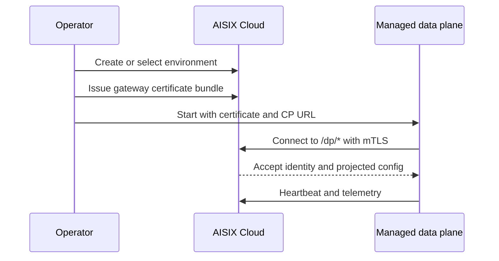

AISIX Cloud uses certificate-based bootstrap for managed data planes. The
data plane receives a certificate bundle, then authenticates to the
Cloud data-plane-manager endpoints with mTLS.

When managed bootstrap fails, check certificate bundle, trust root,
runtime state, and `/dp/*` connectivity before looking at higher-level
routing or projection behavior.

## Managed bootstrap flow

The managed flow is:

1. Create or select an environment.
2. Issue a gateway certificate bundle through the control plane.
3. Start the data plane with the certificate bundle and data-plane
   manager URL.
4. Let the data plane authenticate to `/dp/*` routes with mTLS.
5. Observe heartbeat, telemetry, and configuration projection.

The certificate bundle flow is the current managed bootstrap path. Do
not assume a bearer-token registration path unless you are intentionally
operating a legacy or custom setup.

## Bootstrap checklist

Before starting the managed data plane, confirm:

| Check | Why it matters |
| --- | --- |
| The environment is the one you expect to serve | Projection is environment-scoped. |
| The certificate, key, and CA come from the issued gateway bundle | `/dp/*` authentication uses this mTLS identity. |
| `AISIX_MANAGED__CP_BASE_URL` points to the data-plane-manager origin | The data plane calls `/dp/heartbeat`, `/dp/telemetry`, `/dp/rotate-cert`, and `/dp/budget_check` there. |
| The container can read certificate files or inline PEM values | The data plane cannot authenticate if the bundle is unreadable. |
| The runtime state directory is writable | The data plane persists identity and mTLS state across restarts. |
| Network policy allows outbound access to the data-plane-manager endpoint | Bootstrap can succeed only if `/dp/*` is reachable. |

## Managed `/dp/*` endpoints

The current managed surface includes several data-plane-manager routes.

`POST /dp/heartbeat` reports data-plane liveness, identity, and resource
status.

`POST /dp/telemetry` sends usage-oriented data to the control plane.

`POST /dp/rotate-cert` supports certificate lifecycle management.

`GET /dp/budget_check` supports managed budget enforcement decisions.

These endpoints belong to the data-plane-manager surface, not the
browser-facing dashboard origin.

## Runtime configuration

`AISIX_MANAGED__CP_BASE_URL` must point to the data-plane-manager origin
that serves `/dp/heartbeat`, `/dp/telemetry`, `/dp/rotate-cert`, and
`/dp/budget_check`.

Examples:

- `https://dpm.example.com:7944` for an externally reachable
  data-plane-manager endpoint
- `https://dpm:7944` when the data plane joins the AISIX Cloud Compose
  network

Do not use the dashboard or control-plane API origin, such as
`http://api:8080`, for this value.

The data plane accepts either inline PEM values:

- `AISIX_MANAGED__CP_CERT_PEM`
- `AISIX_MANAGED__CP_KEY_PEM`
- `AISIX_MANAGED__CP_CA_PEM`

or file paths:

- `AISIX_MANAGED__CP_CERT_FILE`
- `AISIX_MANAGED__CP_KEY_FILE`
- `AISIX_MANAGED__CP_CA_FILE`

If you use file paths from a container, make sure the process user can
read the files and write the runtime state directory, typically
`/var/lib/aisix`. The state directory stores the persisted mTLS bundle
and data-plane identity used on restart.

## Verify managed connectivity

After the data plane starts, verify the managed path in this order:

1. The data plane process starts without certificate or trust-chain errors.
2. Cloud shows the data plane heartbeat for the expected environment.
3. Resource projection reaches the data plane.
4. A live proxy request through the managed data-plane endpoint succeeds.
5. Telemetry or usage events appear in Cloud for that live request.

If step 2 fails, stay on certificate, base URL, and network troubleshooting.
If step 2 succeeds but step 3 or 4 fails, move to
[Resource projection](/ai-gateway/cloud/resource-projection).

## Troubleshooting

### The data plane never appears healthy in Cloud

Check:

- `AISIX_MANAGED__CP_BASE_URL` points to the data-plane-manager origin
- the certificate, key, and CA values match the issued bundle
- the container can read certificate files if file paths are used
- the data plane can write its runtime state directory
- network policy allows the data plane to reach the `/dp/*` surface

### `/dp/*` calls fail after initial success

Inspect certificate rotation, trust-chain changes, and runtime state
first. If identity is healthy but resources still do not apply, move to
projection troubleshooting.

## Next steps

- [Resource projection](/ai-gateway/cloud/resource-projection) explains
  how Cloud resources reach the data plane.
- [Offline resilience](/ai-gateway/cloud/offline-resilience) explains
  what happens during temporary Cloud connectivity loss.
- [TLS and mTLS](/ai-gateway/operations/tls-and-mtls) covers transport
  security concepts.
