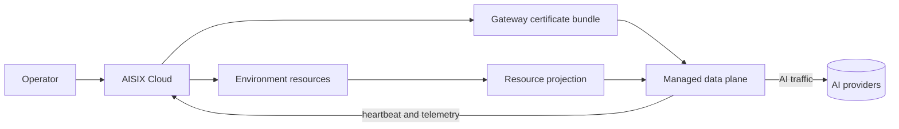

AISIX Cloud adds a managed control plane for AISIX AI Gateway. Instead
of managing every gateway resource through a local admin API, you manage
organization and environment resources in Cloud and let the managed data
plane receive projected configuration.

Use AISIX Cloud when you want AISIX gateway behavior with managed
environment scope, certificate-based data-plane bootstrap, telemetry,
budget workflows, and Cloud-side operational visibility.

## What Cloud adds to gateway operation

AISIX Cloud adds these managed workflows on top of the gateway runtime:

| Workflow | What Cloud owns | What the data plane does |
| --- | --- | --- |
| Organization and environment scope | Tenant and deployment boundaries | Serves the environment it is attached to. |
| Gateway certificate issuance | Managed identity and trust material | Authenticates to `/dp/*` routes with mTLS. |
| Resource projection | Environment-scoped resource state | Receives projected snapshots and serves traffic from them. |
| Usage and budget workflows | Usage ingestion, billing workflows, and budget decisions | Emits telemetry and enforces returned budget decisions. |
| Offline resilience | Control-plane recovery workflow | Continues serving from the current accepted snapshot during temporary connectivity loss. |

The gateway still serves live AI traffic in the data plane. Cloud changes
how resources are scoped, delivered, observed, and managed.

## How the managed path works

At a high level, the Cloud path is:

1. Create or select an organization and environment.
2. Define environment-scoped gateway resources.
3. Issue a gateway certificate bundle.
4. Start the managed data plane with the Cloud bootstrap inputs.
5. Wait for projection, heartbeat, and ready traffic flow.

## When to use Cloud

Choose AISIX Cloud when:

- you want environment-scoped gateway management
- you do not want to expose or operate the standalone admin API as the
  primary management surface
- you want managed certificate issuance and mTLS data-plane workflows
- you want Cloud-side usage, billing, and budget features

Choose self-hosted AISIX when you want direct local ownership of the
gateway process, etcd, bootstrap config, and admin API.

## Important boundaries

Cloud and self-hosted deployments share the gateway runtime, but they do
not have the same operational model. In Cloud mode, the control plane
projects resources into the data plane asynchronously. A saved resource
in Cloud is not the same event as that resource being active on a
specific data-plane instance.

The Cloud playground also has its own boundary: it is useful for preview
checks, but it does not exercise every managed data-plane feature such as
routing, cache, guardrails, and rate limits.

When debugging Cloud-managed behavior, confirm three things before
changing resource definitions:

1. The resource belongs to the environment served by the data plane.
2. The managed data plane is healthy and connected.
3. The live request is sent through the managed data-plane endpoint, not
   only through a preview surface.

## Next steps

- [Organizations and environments](/ai-gateway/cloud/organizations-and-environments)
  explains Cloud resource scope.
- [Gateway certificates and managed data plane](/ai-gateway/cloud/gateway-certificates-and-managed-dp)
  explains managed bootstrap.
- [Cloud vs. self-hosted](/ai-gateway/cloud/cloud-vs-self-hosted)
  compares the two operating models.
