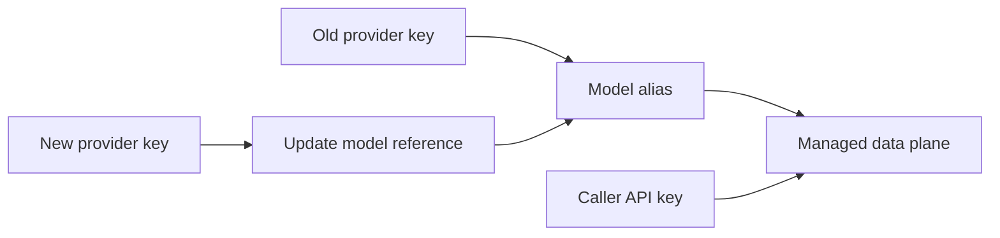

Provider key rotation changes the upstream credential behind a model
without changing the caller-facing API key or model alias.

This separation is one of the main reasons to put AISIX between
applications and AI providers. Callers keep using the same AISIX API key
and model name while operators rotate the provider credential behind the
gateway.

## Rotation flow

The managed rotation sequence is:

1. Create a new provider key with the rotated upstream credential.
2. Update the model to reference the new provider key.
3. Wait for projection to the managed data plane.
4. Send a live request through the managed data plane.
5. Remove or disable the old provider key after traffic is confirmed.

## What stays stable

The caller does not need a new AISIX API key. The application also does
not need to change the model alias if the model resource keeps the same
name.

What changes is the provider key reference used when AISIX dispatches
the request upstream.

## Verify

After rotation:

- confirm the model references the replacement provider key
- confirm projection reached the managed data plane
- send a request through the managed data-plane endpoint
- check logs or usage events to confirm live traffic succeeds
- only then remove the old credential from service

## Troubleshooting

### Cloud shows the new provider key, but live traffic still uses old behavior

Check projection timing and the model's provider-key reference before
assuming the new credential is invalid.

### Live traffic fails after rotation

Check the new upstream credential, provider-specific auth shape, and
model reference. If the provider key is valid but the data plane has not
received the update, troubleshoot projection.

## Next steps

- [Provider keys](/ai-gateway/configuration/provider-keys) explains the
  provider-key resource.
- [Models](/ai-gateway/configuration/models) explains model aliases and
  provider-key references.
- [Resource projection](/ai-gateway/cloud/resource-projection) explains
  how Cloud changes reach the managed data plane.
