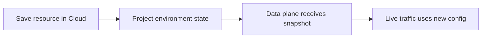

AISIX Cloud stores environment-scoped resources in the control plane and
projects them into the managed data plane. Projection is the Cloud
equivalent of standalone configuration propagation, with an explicit
control-plane to data-plane boundary.

From an operator point of view, projection is the step that turns saved
Cloud resource state into live data-plane behavior.

## How projection reaches the data plane

These are separate events:

1. The resource is saved in Cloud.
2. Cloud projects the environment state.
3. The managed data plane receives the projected snapshot.
4. Live traffic starts using the new configuration.

Projection is usually fast, but it is asynchronous. A successful save in
Cloud does not prove that every data-plane instance is already serving
the new state.

## What to expect

- A data plane can continue serving from its current projected snapshot
  during temporary control-plane connectivity issues.
- Validation of live behavior should use the managed data plane, not
  only the Cloud UI or API response.
- If multiple data-plane instances are attached, they can briefly
  converge at different times.

## Troubleshooting

### Cloud shows the new resource, but live traffic does not use it

Check:

1. The resource belongs to the same environment as the target data plane.
2. The data plane is healthy and connected.
3. Projection has reached the data plane.
4. The request is sent to the managed data plane, not to a preview-only
   path.

If the resource is a model, also confirm the caller is using the expected
model alias. If the resource is a provider key or policy, confirm the
model references the updated resource.

## Next steps

- [Organizations and environments](/ai-gateway/cloud/organizations-and-environments)
  explains Cloud resource scope.
- [Offline resilience](/ai-gateway/cloud/offline-resilience) explains
  behavior during temporary Cloud connectivity loss.
- [Configuration propagation](/ai-gateway/configuration/configuration-propagation)
  explains the standalone propagation model.
