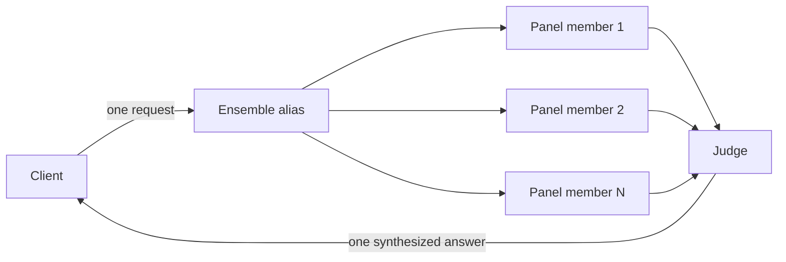

An ensemble model maps one caller-visible alias to a **panel** of direct models plus a **judge**. On a single `/v1/chat/completions` request the gateway calls every panel member concurrently, then asks the judge model to reconcile their answers into one final response. The fan-out and synthesis happen entirely server-side; the caller sends one request and receives one answer.

This is the gateway's second virtual-model mechanism, alongside [routing](routing-and-failover.md). A routing model picks **one** target per request; an ensemble model calls **all** panel members and combines their output.

## When to use an ensemble

Reach for an ensemble when a single model's answer is not reliable enough on its own:

- **Reduce single-model variance and blind spots.** Independent answers that agree are more likely correct; the judge resolves contradictions and discards claims only one model made up.
- **Cross-check hard reasoning or research prompts**, where different models reach the answer by different paths.
- **Self-ensemble from one provider.** A panel can be the *same* direct model repeated with different per-member `temperature`/`seed` values, so a customer with a single provider key gets answer diversity without onboarding new vendors.

An ensemble issues N panel calls plus one judge call for every request, so it costs more and has higher latency than a direct model. Use it where answer quality matters more than per-request cost or time-to-first-token — not on latency-critical or tool-using paths (see [Constraints](#constraints)).

## How it works



1. The gateway dispatches the prompt to every panel member **concurrently**, applying each member's own `temperature`/`seed` override.
2. Once at least [`min_responses`](#min_responses) panel members succeed, it builds a synthesis prompt from the original request and the panel answers and calls the judge.
3. The judge's output is returned to the caller under the ensemble alias.

## Example

Panel members and the judge reference existing **direct** models by `display_name`, so create those first (see [Models](models.md)). Then create the ensemble:

```bash title="Create an ensemble model"
curl -sS -X POST http://127.0.0.1:3001/admin/v1/models \
  -H "Authorization: Bearer YOUR_ADMIN_KEY" \
  -H "Content-Type: application/json" \
  -d '{
    "display_name": "council-of-three",
    "ensemble": {
      "panel": [
        { "model": "kimi-k2",     "temperature": 0.7 },
        { "model": "deepseek-v3", "temperature": 0.7 },
        { "model": "gemini-flash", "temperature": 0.9 }
      ],
      "judge": { "model": "deepseek-v3" },
      "min_responses": 2,
      "timeout_ms": 45000
    }
  }'
```

Callers then use `council-of-three` like any other model:

```bash title="Call the ensemble"
curl -sS -X POST http://127.0.0.1:3000/v1/chat/completions \
  -H "Authorization: Bearer sk-demo-caller" \
  -H "Content-Type: application/json" \
  -d '{
    "model": "council-of-three",
    "messages": [{ "role": "user", "content": "In one sentence, what is an API gateway?" }]
  }'
```

## Configuration reference

### `panel`

A non-empty list of panel members. Each member is a direct model referenced by `display_name`, with optional per-member sampling overrides:

| Field | Type | Notes |
| --- | --- | --- |
| `model` | string (required) | `display_name` of a **direct** model in the same environment. |
| `temperature` | number | Sampling temperature for this member's call. **Overrides the request's `temperature`**, so repeating one model with different temperatures (self-ensemble) still yields diverse answers. Omit to leave the request's temperature unchanged. |
| `seed` | integer | Sampling seed for this member's call; pairs with `temperature` for reproducible diversity. |
| `weight` | integer | Reserved for a future voting strategy and **ignored by v1 synthesis**. Carried on the wire now so enabling voting later needs no format change. |

The same `display_name` may appear more than once — that is how self-ensemble is expressed.

### `judge`

The model that synthesizes the panel answers into one response.

| Field | Type | Notes |
| --- | --- | --- |
| `model` | string (required) | `display_name` of a **direct** model in the same environment. |
| `synthesis_prompt` | string | Optional override of the built-in synthesis template. If set, it must contain both placeholders `{original_request}` and `{labeled_candidates}`. Omit to use the default. |

The judge always runs at a fixed low temperature (`0.2`) for stable synthesis. This is intentionally not operator-configurable in v1.

### `min_responses`

Minimum number of successful panel responses required before the judge runs.

- Omitted → `min(2, panel size)`. A value larger than the panel is clamped to the panel size; the effective value is always at least `1`, so a single-member self-ensemble panel needs one response.
- If fewer than `min_responses` panel members succeed, the request fails rather than synthesizing from too little evidence.

### `timeout_ms`

Optional per-call upstream deadline applied to **each** panel member and the judge call, in milliseconds. This is in addition to each referenced model's own [`timeout`](models.md#timeouts). `0` or absent means no ensemble-level per-call deadline.

## Synthesis

The judge receives the original request and the panel answers as one user message. Answers are labeled neutrally (`Answer 1`, `Answer 2`, …) and **never** carry the panel members' model names. Each candidate answer is capped at 8 KB before it reaches the judge — oversized answers are truncated, not dropped, so a long panel cannot overflow the judge's context window.

The default synthesis instructions tell the judge to treat the candidates as evidence (favoring consensus, resolving contradictions by reasoning, discarding unsupported claims) and to respond with **only** the final answer — no meta-commentary, no mention that multiple models were involved, in the same language and format the user asked for. A custom `synthesis_prompt` replaces these instructions but receives the same `{original_request}` and `{labeled_candidates}` substitutions.

## Streaming

Ensemble models accept `stream: true` (they do not reject it). Because the panel must be fully collected before the judge can synthesize, the panel phase runs non-streaming and only the **judge's** tokens are streamed to the caller. Once the judge starts streaming, the gateway sends SSE keep-alive frames (every 15 seconds) to hold the connection open. The panel phase runs before any bytes are sent and is not yet covered by keep-alive, so budget a client read timeout that absorbs `max(panel latency) + judge time-to-first-token` (see the note below).

:::note
Ensemble time-to-first-token is inherently high — roughly `max(panel latency) + judge time-to-first-token` — because no judge token exists until the panel returns. Budget client read timeouts accordingly.
:::

## Client-facing usage

The response `usage` object is the **aggregate** of every panel call plus the judge call (a flat sum of `prompt_tokens`, `completion_tokens`, and `total_tokens`). This reflects the real cost of the request, so `prompt_tokens` intentionally exceeds the number of tokens the caller sent — each panel member and the judge processed the prompt (the judge also processes the panel answers).

On a streaming request, this aggregate is delivered in the terminal `usage` chunk only when the caller sets `stream_options.include_usage: true` (see [Streaming](../integration/streaming.md)); without it, a streaming response carries no `usage`, exactly as for a direct model.

## Response shape

`response.model` echoes the **ensemble alias the caller requested** — never a panel member's `display_name`, the judge's, or an upstream provider's raw id. The panel composition is server-side only and does not leak to the client, in the response id or the synthesized text.

```json title="Response body"
{
  "id": "chatcmpl-...",
  "model": "council-of-three",
  "choices": [{ "message": { "role": "assistant", "content": "…one synthesized answer…" } }],
  "usage": { "prompt_tokens": 412, "completion_tokens": 96, "total_tokens": 508 }
}
```

Ensemble models, like direct models, are listed on `GET /v1/models`. (Routing aliases remain hidden from that list — see [Models](models.md#what-v1models-exposes).)

## Constraints

v1 ensembles have deliberate limits:

- **Chat only.** Ensembles are supported on `/v1/chat/completions`. Any other endpoint (`/v1/messages`, `/v1/responses`, `/v1/embeddings`, …) rejects an ensemble model with `400` and a message naming the model and the chat-only constraint.
- **No tools.** A request carrying a non-empty `tools` array, or a `tool_choice` that forces a call, is rejected with `400 "ensemble models do not support tools"` — broadcasting a forced tool call to N panel members would yield N conflicting `tool_calls` the caller cannot reconcile. An empty `tools: []`, or `tool_choice` of `none`/`auto`, is treated as no tools and accepted.
- **Direct models only.** Panel members and the judge must reference direct models in the same environment. Ensembles do not nest (no routing or ensemble targets).
- **Config-driven.** There is no per-request panel override; callers select an ensemble only by its model name.

## Error semantics

- **Partial panel failure** is tolerated: if at least `min_responses` panel members succeed, synthesis proceeds with the answers that arrived. A single slow or failing panel member does not fail the request.
- **Too few panel responses** (successes below `min_responses`) fails the request rather than synthesizing from insufficient evidence.
- **Judge failure** fails the request — the gateway does not silently return a raw panel answer, because that would hand the caller a non-synthesized response without signaling it.

## AISIX Cloud

In AISIX Cloud, create and edit ensembles from the dashboard **Models** page instead of the admin API. The create form provides a panel picker (which allows the same model more than once, for self-ensemble), a judge selector, and the per-member `temperature`/`seed`, `min_responses`, and timeout controls. The control plane projects the configuration into the environment-scoped data plane, which runs the same executor described here.

## Verification

After the propagation delay, confirm the ensemble fans out and synthesizes:

```bash
curl -sS -X POST http://127.0.0.1:3000/v1/chat/completions \
  -H "Authorization: Bearer sk-demo-caller" \
  -H "Content-Type: application/json" \
  -d '{ "model": "council-of-three",
        "messages": [{ "role": "user", "content": "In one sentence, what is an API gateway?" }] }' \
  | jq '{ model, choices: (.choices | length), total_tokens: .usage.total_tokens }'
```

Expected result — the observable contract of an ensemble:

```json
{
  "model": "council-of-three",
  "choices": 1,
  "total_tokens": 508
}
```

- `model` is the ensemble alias, not a panel member or upstream id.
- `choices` is exactly `1` — one synthesized answer, not the panel's N answers.
- `total_tokens` is the panel-plus-judge aggregate, so it is larger than the same prompt sent once to a single panel member.

## Troubleshooting

### The request fails with "did not reach the required number of responses"

Fewer than `min_responses` panel members succeeded. Check the referenced direct models resolve and their upstreams are healthy, or lower `min_responses`.

### A request with `tools` returns `400`

Expected — ensembles reject tool use in v1. Use a direct or [routing](routing-and-failover.md) model for tool-calling requests.

### Calling the ensemble on `/v1/messages` or `/v1/responses` returns `400`

Expected — ensembles are chat-only in v1. Call them on `/v1/chat/completions`.

### `response.model` shows the ensemble alias, not the judge

That is the documented contract — the panel and judge never appear in the client-facing response.

## Related pages

- [Models](models.md)
- [Routing And Failover](routing-and-failover.md)
- [Rate Limits](rate-limits.md)
- [Configuration Propagation](configuration-propagation.md)
