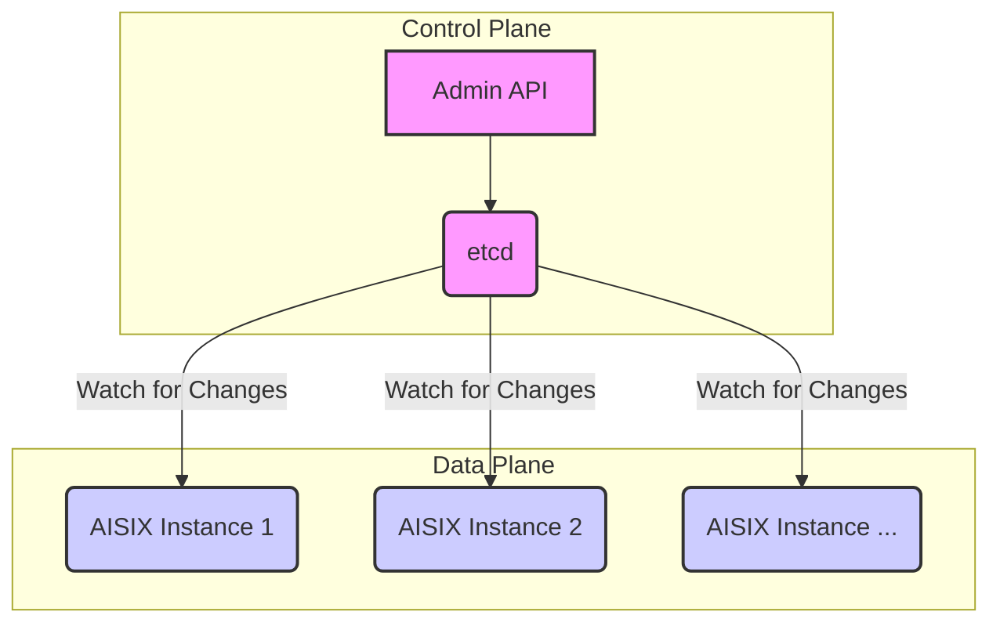

A key feature of AISIX as an enterprise AI gateway is its dynamic configuration. You can modify Models and API Keys at any time, and the changes hot-reload instantly across all gateway nodes without service interruption. This is possible due to its decoupled architecture, which separates the control plane from the data plane — a standard pattern in production LLM proxy deployments.

## Control Plane vs. Data Plane

AISIX has two main components:

-   **Data Plane (DP)**: The core proxy engine. It is a lightweight, high-performance component that handles client traffic, executes the hook pipeline, and forwards requests to upstream LLM providers.

-   **Control Plane (CP)**: The brain of the system. It stores and manages configuration data, such as Models and API Keys, and acts as the single source of truth.

In AISIX, these roles are filled by:

-   **etcd**: The configuration store (part of the CP).
-   The **Admin API**: The management interface (part of the CP).
-   **AISIX proxy instances**: The Data Plane.

## Real-time Updates via `watch`

Dynamic configuration works as follows:

1.  **Configuration Changes**: When you create a Model using the Admin API, the configuration is written to etcd.

2.  **Watching for Updates**: Each AISIX data plane instance maintains a persistent connection to etcd and uses its `watch` mechanism to monitor for changes to the configuration data.

3.  **Instant Propagation**: When a change is written to etcd, etcd notifies all watching AISIX instances.

4.  **In-Memory Cache Update**: Upon receiving a notification, each AISIX instance fetches the updated configuration and refreshes its in-memory cache. This update is atomic and lock-free, designed to minimize performance impact.

This architecture ensures that configuration changes are propagated to all gateway nodes in near real-time, providing a responsive and manageable system.

## Related Docs

- [Overview](../introduction/overview.md) — Architecture overview of AISIX's control and data plane design
- [Model Management](../guides/model-management.md) — How to create and update LLM models via the Admin API
