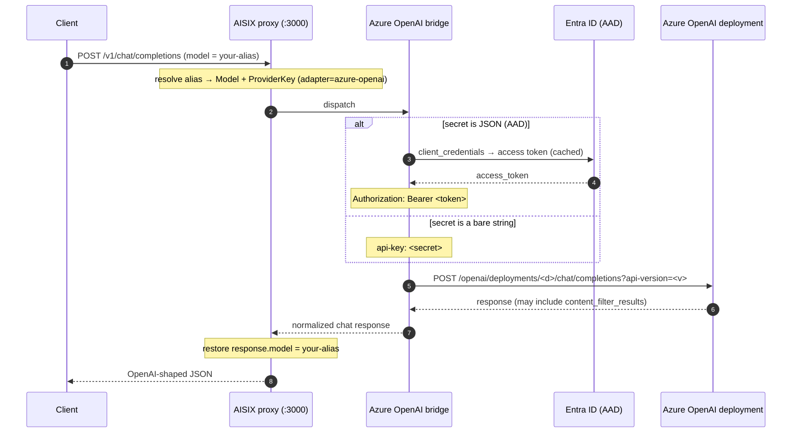

AISIX AI Gateway can route requests to [Azure OpenAI Service](https://learn.microsoft.com/en-us/azure/ai-services/openai/) so callers reach your Azure deployments through the gateway's OpenAI-compatible proxy. This page shows how to register an Azure credential under either supported auth scheme, how the gateway builds the deployment URL, and how to verify a request reached Azure with the correct auth header.

Azure OpenAI uses the `azure-openai` adapter family. The wire shape is OpenAI chat-completions; Azure differs on the URL pattern (deployment-keyed), the auth header, and tolerance for Azure's content-filter response blocks.

## When to use this

- Use this when your OpenAI models run on Azure OpenAI Service and you want them behind the gateway's auth, allowlist, rate limiting, and usage accounting.
- Use this when you authenticate to Azure with a resource api-key, or with Entra ID (Azure AD) `client_credentials`.
- For models you host yourself, see [Bring your own endpoint](../configuration/byo-endpoint.md) instead.

## How it works

The gateway builds the Azure chat-completions URL from the deployment name (the model's `model_name`) and the resource (the provider key's `api_base`):

```text
https://<resource>.openai.azure.com/openai/deployments/<deployment>/chat/completions?api-version=<version>
```

The auth scheme is detected from the **shape** of the provider key's `secret`:

- A bare string secret → the `api-key: <secret>` header (Azure's resource-key scheme; **not** `Authorization: Bearer`).
- A JSON object secret `{tenant_id, client_id, client_secret, ...}` → the Entra ID (AAD) `client_credentials` flow. The gateway mints an OAuth2 access token and sends `Authorization: Bearer <token>`.

The gateway reuses the OpenAI chat-completions wire and tolerates Azure's `prompt_filter_results` / `content_filter_results` response extensions, so a content-filtered response still deserializes cleanly.



## Prerequisites

- A running self-hosted gateway (admin on `:3001`, proxy on `:3000`). See the [Self-Hosted Quickstart](../quickstart/self-hosted.md).
- Your admin key from the bootstrap config.
- An Azure OpenAI resource and a deployment, plus either the resource api-key or an Entra ID app registration (`tenant_id`, `client_id`, `client_secret`) granted access to the resource.

## Configuration

Both auth schemes share the same model and caller-key steps; only the provider-key `secret` differs.

:::warning Production credentials
The standalone gateway stores `secret` as plaintext under the etcd `prefix` from [`config.yaml`](../configuration/bootstrap-config.md). For production, front etcd with encryption-at-rest, restrict etcd network access to the gateway, or use AISIX Cloud's managed [Provider Key Rotation](../cloud/provider-key-rotation.md), where the secret stays in the control plane and only the projected reference reaches the data plane.
:::

### Step 1: Create the Azure provider key

#### Option A — api-key auth

The `secret` is the verbatim resource api-key string. `api_base` is the resource host.

```bash title="Create an Azure provider key (api-key auth)"
curl -sS -X POST http://127.0.0.1:3001/admin/v1/provider_keys \
  -H "Authorization: Bearer YOUR_ADMIN_KEY" \
  -H "Content-Type: application/json" \
  -d '{
    "display_name": "azure-prod",
    "provider": "azure",
    "adapter": "azure-openai",
    "secret": "YOUR_AZURE_API_KEY",
    "api_base": "https://acme-west.openai.azure.com"
  }'
```

#### Option B — Entra ID (AAD) auth

The `secret` is a JSON object. Its `{` prefix is what tells the gateway to use the AAD `client_credentials` flow.

```bash title="Create an Azure provider key (AAD auth)"
curl -sS -X POST http://127.0.0.1:3001/admin/v1/provider_keys \
  -H "Authorization: Bearer YOUR_ADMIN_KEY" \
  -H "Content-Type: application/json" \
  -d '{
    "display_name": "azure-aad-prod",
    "provider": "azure",
    "adapter": "azure-openai",
    "secret": "{\"tenant_id\":\"YOUR_TENANT_ID\",\"client_id\":\"YOUR_CLIENT_ID\",\"client_secret\":\"YOUR_CLIENT_SECRET\"}",
    "api_base": "https://acme-west.openai.azure.com"
  }'
```

The AAD `secret` fields are:

| Field | Required | Description |
|---|---|---|
| `tenant_id` | Yes | Entra ID tenant UUID (or vanity domain). Interpolated into the token endpoint path. |
| `client_id` | Yes | App-registration (application) UUID. |
| `client_secret` | Yes | The client secret value (not the secret id). |
| `authority_host` | No | AAD authority origin. Omit for public Azure (defaults to `https://login.microsoftonline.com`). Set it for a national / sovereign cloud — `https://login.microsoftonline.us` (US Government) or `https://login.chinacloudapi.cn` (China, 21Vianet). Must be a bare http(s) origin; the gateway appends the tenant and the `/oauth2/v2.0/token` path. |

For a national-cloud tenant, add `authority_host` to the JSON secret:

```json title="AAD secret with national-cloud authority host"
{
  "tenant_id": "YOUR_TENANT_ID",
  "client_id": "YOUR_CLIENT_ID",
  "client_secret": "YOUR_CLIENT_SECRET",
  "authority_host": "https://login.microsoftonline.us"
}
```

The minted token is cached in-process, keyed by `(tenant_id, client_id)`, and refreshed about 60 seconds before its reported expiry.

For both options, `adapter` must be `azure-openai` and `provider` is a free-form vendor label (`azure` matches the AISIX Cloud catalog id). Capture the returned `id` for the next step.

#### `api_base` and the API version

`api_base` is the Azure resource host. The gateway accepts three shapes:

- The canonical resource URL `https://<resource>.openai.azure.com` (the resource name is extracted from the host).
- A bare resource name (for example `acme-west`).
- A verbatim override URL whose host does **not** end in `.openai.azure.com` — used for a corporate proxy, a private-VPC endpoint, or a mock. The gateway appends `/openai/deployments/<deployment>/chat/completions?api-version=<version>` to whatever you supply. (Verbatim overrides must not embed userinfo, a query string, or a fragment.)

The gateway pins a GA `api-version` default (`2024-10-21`). Azure deprecates older API versions on a [published schedule](https://learn.microsoft.com/en-us/azure/ai-services/openai/api-version-deprecation), so treat the default as a stop-gap and plan to track the version your deployment requires.

### Step 2: Create the model

`model_name` is the Azure **deployment** name (the name you gave the deployment in the Azure portal), not the underlying model id. The customer-facing alias is `display_name`.

```bash title="Create a model for an Azure deployment"
curl -sS -X POST http://127.0.0.1:3001/admin/v1/models \
  -H "Authorization: Bearer YOUR_ADMIN_KEY" \
  -H "Content-Type: application/json" \
  -d '{
    "display_name": "gpt-4o-azure",
    "provider": "azure",
    "model_name": "gpt4o-prod",
    "provider_key_id": "YOUR_PROVIDER_KEY_ID"
  }'
```

### Step 3: Create a caller API key

```bash title="Hash a plaintext caller key"
printf 'sk-demo-caller' | sha256sum | cut -d' ' -f1
```

```bash title="Create a caller API key"
curl -sS -X POST http://127.0.0.1:3001/admin/v1/apikeys \
  -H "Authorization: Bearer YOUR_ADMIN_KEY" \
  -H "Content-Type: application/json" \
  -d '{
    "key_hash": "YOUR_CALLER_KEY_HASH",
    "allowed_models": ["gpt-4o-azure"]
  }'
```

### Step 4: Send a request

Allow about a second for the configuration to propagate, then call the gateway. The request is identical regardless of which auth scheme the provider key uses.

```bash title="Send a chat completion to Azure"
curl -sS -X POST http://127.0.0.1:3000/v1/chat/completions \
  -H "Authorization: Bearer sk-demo-caller" \
  -H "Content-Type: application/json" \
  -d '{
    "model": "gpt-4o-azure",
    "messages": [
      {"role": "user", "content": "Say hello from Azure OpenAI."}
    ]
  }'
```

Expected response (OpenAI-shaped, alias restored):

```json title="200 OK"
{
  "id": "cmpl-azure-...",
  "object": "chat.completion",
  "model": "gpt-4o-azure",
  "choices": [
    {
      "index": 0,
      "message": {"role": "assistant", "content": "Hello from Azure OpenAI!"},
      "finish_reason": "stop"
    }
  ],
  "usage": {"prompt_tokens": 7, "completion_tokens": 5, "total_tokens": 12}
}
```

## Verification

Confirm the observable facts a `200` does not, by itself, prove.

### `response.model` is the alias, not the deployment name

```bash title="Confirm alias restore"
curl -sS -X POST http://127.0.0.1:3000/v1/chat/completions \
  -H "Authorization: Bearer sk-demo-caller" \
  -H "Content-Type: application/json" \
  -d '{"model":"gpt-4o-azure","messages":[{"role":"user","content":"ping"}]}' \
  | grep -o '"model":"[^"]*"'
```

Expected: `"model":"gpt-4o-azure"` — your alias, not the deployment `gpt4o-prod`. This is the gateway-wide alias-restore contract.

### The outbound auth header matches the credential scheme

The gateway's e2e coverage asserts the outbound shape against a mock Azure: for an api-key provider key the request carries the `api-key` header (and **no** `Authorization` header); for an AAD provider key it carries `Authorization: Bearer <minted-token>`. In both cases the outbound URL is `/openai/deployments/<deployment>/chat/completions?api-version=<version>` with the deployment taken from the model's `model_name`.

Confirm the auth path indirectly:

```bash title="Negative check — bad credentials surface as upstream auth failure"
curl -sS -o /dev/null -w "%{http_code}\n" -X POST http://127.0.0.1:3000/v1/chat/completions \
  -H "Authorization: Bearer sk-demo-caller" \
  -H "Content-Type: application/json" \
  -d '{"model":"gpt-4o-azure","messages":[{"role":"user","content":"ping"}]}'
```

With a valid credential, expect `200`. With an invalid api-key, or invalid AAD client credentials, expect a configuration or upstream error — confirming the gateway selected the auth scheme and dispatched to Azure. Upstream Azure error envelopes (which can contain the deployment name and resource host) are redacted to a canned, status-keyed message before reaching the caller.

## Content-filter tolerance

Azure attaches `prompt_filter_results` and `content_filter_results` blocks to successful responses. The gateway tolerates these extension fields and returns the standard OpenAI envelope unchanged — a content-annotated `200` from Azure still deserializes and reaches the caller as a normal chat completion. A request that Azure blocks for a content-policy violation surfaces as an upstream error with the Azure error code preserved for downstream translation.

## Limitations

- The `api-version` default is a GA stop-gap; track the version your deployment requires and plan for Azure's deprecation schedule.
- Verbatim `api_base` overrides accept any reachable host; a typo routes traffic to wherever that host resolves. Double-check the override URL.
- The AAD path mints a token per `(tenant_id, client_id)` and caches it; a revoked client secret surfaces as an upstream auth failure on the next mint.

## Related pages

- [Adapter protocol families](../reference/adapters.md) — where Azure OpenAI fits among the five adapters.
- [Provider keys](../configuration/provider-keys.md) — the credential resource and `api_base` behavior.
- [AWS Bedrock upstream](upstream-bedrock.md) and [Google Vertex AI upstream](upstream-vertex.md) — the other specialized-family guides.
