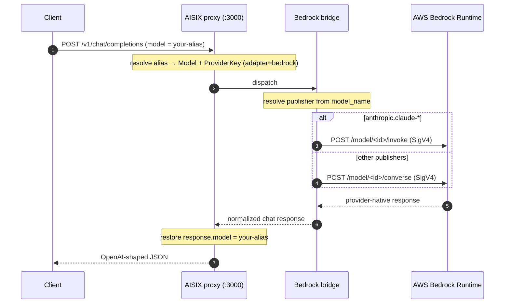

AISIX AI Gateway can route requests to [AWS Bedrock](https://docs.aws.amazon.com/bedrock/) so callers reach Claude, Llama, Mistral, Amazon Nova, Cohere, and other Bedrock-hosted models through the gateway's OpenAI-compatible proxy. This page shows how to register Bedrock credentials, how the gateway picks the right Bedrock wire shape per model, and how to verify a request reached Bedrock with the correct signing.

Bedrock uses the `bedrock` adapter family. The gateway signs every outbound call with AWS SigV4 through the AWS SDK and renders the response back to the caller as an OpenAI chat-completions envelope.

## When to use this

- Use this when your models run on AWS Bedrock and you want them behind the gateway's auth, allowlist, rate limiting, and usage accounting.
- Use this when you need cross-region inference profiles (`us.`, `eu.`, `apac.`, `global.`, `us-gov.`).
- For models you host yourself, see [Bring your own endpoint](../configuration/byo-endpoint.md) instead.

## How it works

The gateway resolves the Bedrock publisher from the model id and dispatches to the matching wire shape:

- **Anthropic** (`anthropic.claude-*`) — dispatched through the legacy Bedrock `/invoke` route (`InvokeModel`) with an Anthropic Messages JSON body. The `model` field is stripped (Bedrock keys dispatch off the URL path) and `anthropic_version: "bedrock-2023-05-31"` is added.
- **All other publishers** (`meta.llama*`, `mistral.*`, `amazon.titan-*`, `amazon.nova-*`, `cohere.command*`, `ai21.jamba-*`, and other catalog publishers) — dispatched through the unified [Converse API](https://docs.aws.amazon.com/bedrock/latest/APIReference/API_runtime_Converse.html) (`/converse`).

Authentication is AWS SigV4, computed by the AWS SDK from the credentials in the provider key's `secret`. The model's `model_name` is the Bedrock model id and is passed to Bedrock verbatim, including any cross-region inference profile prefix.



## Prerequisites

- A running gateway (admin on `:3001`, proxy on `:3000`). See the [Quickstart](../quickstart).
- Your admin key from the bootstrap config.
- AWS credentials with `bedrock:InvokeModel` (and `bedrock:Converse`) permission, and a Bedrock model you have requested access to in the target region.

## Values to collect

Before creating AISIX resources, collect these upstream values:

| Value | Where it is used |
| --- | --- |
| AWS access key id and secret access key | `secret.access_key_id` and `secret.secret_access_key` on the provider key |
| AWS region | `secret.region`; also determines the standard Bedrock Runtime host |
| Optional STS session token | `secret.session_token` when you use temporary credentials |
| Bedrock model id or inference profile id | `model_name` on the model resource |
| Caller-facing alias | `display_name` on the model resource and `allowed_models` on the caller API key |

## Create a Bedrock provider key

The `secret` is a JSON-encoded AWS credential blob. The base URL is not part of the secret — leave `api_base` unset for standard AWS, or set it to a private Bedrock endpoint (VPC endpoint) if you have one.

:::warning Production credentials
The standalone gateway stores `secret` as plaintext under the etcd `prefix` from [`config.yaml`](../configuration/bootstrap-config.md). For production, front etcd with encryption-at-rest, restrict etcd network access to the gateway, or use AISIX Cloud's managed [Provider Key Rotation](../cloud/provider-key-rotation.md), where the secret stays in the control plane and only the projected reference reaches the data plane.
:::

```shell
curl -sS -X POST http://127.0.0.1:3001/admin/v1/provider_keys \
  -H "Authorization: Bearer YOUR_ADMIN_KEY" \
  -H "Content-Type: application/json" \
  -d '{
    "display_name": "bedrock-prod",
    "provider": "amazon-bedrock",
    "adapter": "bedrock",
    "secret": "{\"access_key_id\":\"YOUR_AWS_ACCESS_KEY_ID\",\"secret_access_key\":\"YOUR_AWS_SECRET_ACCESS_KEY\",\"region\":\"us-west-2\"}"
  }'
```

The `secret` value is a JSON string. It must include `access_key_id`,
`secret_access_key`, and `region`. Bedrock's endpoint is region-keyed, for
example `bedrock-runtime.us-west-2.amazonaws.com`, so the region is required.

Include `session_token` when you use temporary STS credentials. Omit it for
long-lived static keys.

`adapter` must be `bedrock` — this is the dispatch key that routes the provider key to the Bedrock bridge. `provider` is a free-form vendor label (`amazon-bedrock` matches the AISIX Cloud catalog id).

Capture the returned `id` for the next step.

## Create a model

`model_name` is the Bedrock model id. The customer-facing alias is `display_name`.

```shell
curl -sS -X POST http://127.0.0.1:3001/admin/v1/models \
  -H "Authorization: Bearer YOUR_ADMIN_KEY" \
  -H "Content-Type: application/json" \
  -d '{
    "display_name": "claude-bedrock",
    "provider": "amazon-bedrock",
    "model_name": "anthropic.claude-3-5-sonnet-20241022-v2:0",
    "provider_key_id": "YOUR_PROVIDER_KEY_ID"
  }'
```

For a Converse-path model, set `model_name` to the publisher's Bedrock id, for example `meta.llama3-3-70b-instruct-v1:0` or `amazon.nova-pro-v1:0`.

### Use Cross-Region Inference Profiles

To use a [cross-region inference profile](https://docs.aws.amazon.com/bedrock/latest/userguide/cross-region-inference.html), prefix the model id with the geography (`us.`, `eu.`, `apac.`, `global.`, or `us-gov.`):

```json
{
  "model_name": "us.anthropic.claude-3-5-sonnet-20241022-v2:0"
}
```

The gateway uses the prefix only to resolve the publisher; the full prefixed id is passed to Bedrock verbatim on the outbound call.

## Create a caller API key

```shell
if command -v sha256sum >/dev/null 2>&1; then
  printf '%s' 'sk-demo-caller' | sha256sum | cut -d' ' -f1
else
  printf '%s' 'sk-demo-caller' | shasum -a 256 | awk '{print $1}'
fi
```

```shell
curl -sS -X POST http://127.0.0.1:3001/admin/v1/apikeys \
  -H "Authorization: Bearer YOUR_ADMIN_KEY" \
  -H "Content-Type: application/json" \
  -d '{
    "key_hash": "YOUR_CALLER_KEY_HASH",
    "allowed_models": ["claude-bedrock"]
  }'
```

## Send a Request

Admin writes propagate to the proxy asynchronously. Before sending traffic, poll `/v1/models` until the alias appears for the caller key.

```shell
curl -sS -X POST http://127.0.0.1:3000/v1/chat/completions \
  -H "Authorization: Bearer sk-demo-caller" \
  -H "Content-Type: application/json" \
  -d '{
    "model": "claude-bedrock",
    "messages": [
      {"role": "user", "content": "Say hello from Bedrock."}
    ]
  }'
```

Expected response (OpenAI-shaped, alias restored):

```json
{
  "id": "msg_01...",
  "object": "chat.completion",
  "model": "claude-bedrock",
  "choices": [
    {
      "index": 0,
      "message": {"role": "assistant", "content": "Hello from Bedrock!"},
      "finish_reason": "stop"
    }
  ],
  "usage": {"prompt_tokens": 9, "completion_tokens": 5, "total_tokens": 14}
}
```

## Verify

Confirm the two observable facts a `200` does not, by itself, prove.

### `response.model` is the alias, not the Bedrock id

```shell
curl -sS -X POST http://127.0.0.1:3000/v1/chat/completions \
  -H "Authorization: Bearer sk-demo-caller" \
  -H "Content-Type: application/json" \
  -d '{"model":"claude-bedrock","messages":[{"role":"user","content":"ping"}]}' \
  | grep -o '"model":"[^"]*"'
```

Expected: `"model":"claude-bedrock"` — your alias, not `anthropic.claude-3-5-sonnet-20241022-v2:0`. This is the gateway-wide alias-restore contract; the Bedrock adapter flows through the same render path as every other family.

### The outbound request is SigV4-signed against the Converse or invoke route

The gateway sends an `Authorization: AWS4-HMAC-SHA256 Credential=...` header (SigV4, **not** a Bearer token) and calls `/model/<modelId>/converse` for Converse-path publishers, or `/model/<modelId>/invoke` for `anthropic.*`. You cannot read AWS's inbound headers directly, but you can confirm the signing path indirectly:

```shell
curl -sS -o /dev/null -w "%{http_code}\n" -X POST http://127.0.0.1:3000/v1/chat/completions \
  -H "Authorization: Bearer sk-demo-caller" \
  -H "Content-Type: application/json" \
  -d '{"model":"claude-bedrock","messages":[{"role":"user","content":"ping"}]}'
```

With a correctly-scoped key, expect `200`. With invalid AWS credentials on the provider key, expect a `5xx` upstream error — confirming the SDK signed and dispatched to Bedrock rather than short-circuiting. Upstream AWS error envelopes (which can contain account ids and IAM role names) are redacted to a canned, status-keyed message before reaching the caller.

## Limitations

- **Streaming** dispatches all publishers through the Converse stream API (`/converse-stream`). Confirm streaming behavior against your specific publisher.
- **Anthropic on Bedrock** uses the legacy `/invoke` route for non-streaming chat to preserve the Anthropic Messages body shape; other publishers use Converse.
- **Converse-path publishers** require at least one user or assistant turn. System-only requests are rejected before dispatch because Bedrock Converse does not accept an empty `messages` array.
- Upstream error detail from AWS is intentionally redacted in the customer-visible error to avoid leaking operator-internal identifiers (ARNs, region, account id).

## Next steps

- [Choose a provider upstream](provider-upstreams.md) — compare upstream setup paths.
- [Adapter protocol families](../reference/adapters.md) — where Bedrock fits among the five adapters.
- [Provider keys](../configuration/provider-keys.md) — the credential resource and `api_base` behavior.
- [OpenAI-compatible API](openai-compatible-api.md) — the proxy surface callers use.
- [Google Vertex AI upstream](upstream-vertex.md) and [Azure OpenAI upstream](upstream-azure-openai.md) — the other specialized-family guides.
