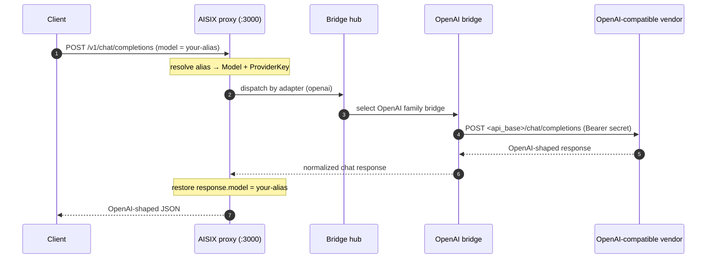

This guide shows how to onboard a public OpenAI-compatible vendor — DeepSeek, Groq, Mistral, Together.ai, Fireworks, Perplexity, and similar services — to AISIX AI Gateway. These vendors expose the OpenAI chat-completions wire at a known public host, so they all dispatch through the `openai` [adapter](../reference/adapters.md) family. Callers reach them through the same OpenAI-compatible proxy surface and the same caller API keys as any other model.

## When to use this

- Use this when the upstream is a **public** vendor that serves the OpenAI chat-completions API at a documented host (for example `https://api.deepseek.com` or `https://api.groq.com/openai/v1`).
- Use this in the **self-hosted** gateway, where you register the vendor's host and credential yourself through the admin API.
- In **AISIX Cloud**, you usually do not need this guide: the control plane fills in the adapter and base URL when you select a catalog provider. See [Where the values come from](#where-the-values-come-from) below.

This guide is different from two nearby pages:

- [Bring your own endpoint](../configuration/byo-endpoint.md) covers **private or self-hosted** OpenAI-compatible servers (vLLM, SGLang, Ollama, an internal proxy). The mechanics are identical; the difference is that a BYO endpoint is yours and not on a public host.
- [OpenAI-compatible API](openai-compatible-api.md) documents the **client-facing** proxy surface — the API your callers use to reach the gateway. This page is about the **upstream** side: pointing the gateway at a vendor.

## How it works

An OpenAI-compatible vendor is configured through two resources, exactly like any other upstream:

1. A [provider key](../configuration/provider-keys.md) holding the vendor credential (`secret`), its base URL (`api_base`), the vendor identity (`provider`), and the wire shape (`adapter: openai`).
2. A direct [model](../configuration/models.md) that maps a caller-facing alias (`display_name`) to the vendor's model id (`model_name`) and references the provider key.

Because these are public vendors with a non-`openai` vendor identity, **you must set `api_base`**. The OpenAI-family bridge only falls back to `https://api.openai.com` when the provider key's vendor identity is `openai` (or empty). For any other vendor it refuses to guess a base URL and fails dispatch. Set `api_base` to the vendor's documented host.

Each vendor's canonical `api_base` form differs. Some vendors serve
OpenAI-compatible paths at the host root; others use a `/v1` or `/openai/v1`
prefix. AISIX tolerates common paste variants, but it does not invent a
vendor-specific prefix for you. Use the base URL from the provider's current API
reference. See [Provider keys](../configuration/provider-keys.md#base-url) for
base URL guidance and [URL normalization](../configuration/provider-keys.md#url-normalization)
for the gateway normalization rules.



## Prerequisites

- A running gateway (admin on `:3001`, proxy on `:3000`). See the [Quickstart](../quickstart).
- Your admin key from the bootstrap config.
- A vendor API key and the vendor's documented OpenAI-compatible host. The examples below use DeepSeek (`https://api.deepseek.com`, model id `deepseek-chat`).

## Create a provider key

:::warning Production credentials
The standalone gateway stores `secret` as plaintext under the etcd `prefix` from [`config.yaml`](../configuration/bootstrap-config.md). For production, front etcd with encryption-at-rest, restrict etcd network access to the gateway, or use AISIX Cloud's managed [Provider Key Rotation](../cloud/provider-key-rotation.md), where the secret stays in the control plane and only the projected reference reaches the data plane.
:::

```shell
curl -sS -X POST http://127.0.0.1:3001/admin/v1/provider_keys \
  -H "Authorization: Bearer YOUR_ADMIN_KEY" \
  -H "Content-Type: application/json" \
  -d '{
    "display_name": "deepseek-prod",
    "provider": "deepseek",
    "adapter": "openai",
    "secret": "YOUR_PROVIDER_API_KEY",
    "api_base": "https://api.deepseek.com"
  }'
```

Use a vendor label that is specific enough for dispatch and metrics, such as
`deepseek`, `groq`, `mistral`, `together`, `fireworks`, or `perplexity`.

Set `adapter` to `openai` for OpenAI-compatible vendors. Set `provider` to the
actual vendor identity, not `openai`, unless the upstream is OpenAI. This keeps
metrics readable and prevents the bridge from falling back to the public OpenAI
host if `api_base` is removed.

Set `api_base` to the provider's documented OpenAI-compatible base URL. The
example uses DeepSeek's documented host for `deepseek-chat`; for another vendor,
replace both `api_base` and `model_name` with values from that provider's API
reference.

Capture the returned `id` for the next step. The admin API returns a `ResourceEntry` with an `id` field; [Understand admin resources](../quickstart/first-model-first-key-first-request.md#inspect-the-resources) shows a `jq`-capturing one-liner if you want to script it.

## Create a model

Map a caller-facing alias to the vendor's model id.

```shell
curl -sS -X POST http://127.0.0.1:3001/admin/v1/models \
  -H "Authorization: Bearer YOUR_ADMIN_KEY" \
  -H "Content-Type: application/json" \
  -d '{
    "display_name": "deepseek-chat-prod",
    "provider": "deepseek",
    "model_name": "deepseek-chat",
    "provider_key_id": "YOUR_PROVIDER_KEY_ID"
  }'
```

- `display_name` is the alias callers send in `model` and the value `response.model` echoes back.
- `model_name` is the vendor's model id — the literal string the vendor expects in its `model` field.
- `provider` on the model is the same vendor label as on the key.
- `cost` is optional. Public vendors are not in the gateway's standalone pricing path, so set a `cost` block if you want per-token budget accounting available to AISIX Cloud or your own usage-event consumer. See [Models](../configuration/models.md#cost-metadata).

## Create a caller API key

The data plane stores `key_hash`, not plaintext. Hash a plaintext caller key, then create the key resource scoped to your new alias.

```shell
if command -v sha256sum >/dev/null 2>&1; then
  printf '%s' 'sk-demo-caller' | sha256sum | cut -d' ' -f1
else
  printf '%s' 'sk-demo-caller' | shasum -a 256 | awk '{print $1}'
fi
```

```shell
curl -sS -X POST http://127.0.0.1:3001/admin/v1/apikeys \
  -H "Authorization: Bearer YOUR_ADMIN_KEY" \
  -H "Content-Type: application/json" \
  -d '{
    "key_hash": "YOUR_CALLER_KEY_HASH",
    "allowed_models": ["deepseek-chat-prod"]
  }'
```

## Send a Request

Admin writes propagate to the proxy asynchronously. Before sending traffic, poll `/v1/models` until the alias appears for the caller key.

```shell
curl -sS -X POST http://127.0.0.1:3000/v1/chat/completions \
  -H "Authorization: Bearer sk-demo-caller" \
  -H "Content-Type: application/json" \
  -d '{
    "model": "deepseek-chat-prod",
    "messages": [
      {"role": "user", "content": "Say hello from DeepSeek."}
    ]
  }'
```

## Where the values come from

The two modes differ only in where the field values come from:

- **Self-hosted** — you set `provider`, `adapter: openai`, `api_base`, and `secret` on the provider key yourself, exactly as shown above. The gateway ships no provider catalog.
- **AISIX Cloud** — the control plane maps each catalog provider to an adapter and base URL. You select the provider in the dashboard; the projected provider key reaches the data plane with `adapter: openai` and the provider's OpenAI-compatible base URL already set. See [Adapter protocol families § Catalog and bring-your-own providers](../reference/adapters.md#catalog-and-bring-your-own-providers).

Catalog presentation affects dashboard discovery only. It does not change data-plane dispatch: an OpenAI-compatible catalog provider and a self-hosted provider key with `adapter: openai` both run through the same OpenAI bridge.

## Verify

A `200` alone does not prove the gateway reached the vendor and applied the alias contract. Verify the two observable facts that do.

### The alias is restored on `response.model`

```shell
curl -sS -X POST http://127.0.0.1:3000/v1/chat/completions \
  -H "Authorization: Bearer sk-demo-caller" \
  -H "Content-Type: application/json" \
  -d '{"model":"deepseek-chat-prod","messages":[{"role":"user","content":"ping"}]}' \
  | grep -o '"model":"[^"]*"'
```

Expected: `"model":"deepseek-chat-prod"` — your caller-facing alias, **not** the upstream `deepseek-chat`. This proves the request resolved through your model and the gateway restored the alias on the way out. If you see the vendor's model id instead, the request did not flow through the gateway's render path.

### The request actually reached the vendor

Confirm dispatch targets your configured `api_base` and not a default host. Temporarily point `api_base` at an unreachable host and confirm the gateway returns an upstream error rather than a `200`:

```shell
curl -sS -o /dev/null -w "%{http_code}\n" -X POST http://127.0.0.1:3000/v1/chat/completions \
  -H "Authorization: Bearer sk-demo-caller" \
  -H "Content-Type: application/json" \
  -d '{"model":"deepseek-chat-prod","messages":[{"role":"user","content":"ping"}]}'
```

With a healthy vendor host, expect `200`. With `api_base` pointing at a dead host, expect a `5xx` upstream error — confirming dispatch uses your `api_base` and not a built-in default. An authentication failure (`401`) instead of a successful response usually means the `secret` is wrong for the vendor.

## Limitations

- This path is for vendors that speak the OpenAI chat-completions wire. A vendor with a non-OpenAI wire shape needs a native adapter — see [Adapter protocol families](../reference/adapters.md).
- A missing `api_base` on a non-`openai` vendor fails dispatch with a configuration error. Always set `api_base`.
- Vendor-specific response extensions beyond the OpenAI envelope are not normalized. Reasoning-style fields can be lifted per key via the `response.reasoning_field` override; see [Provider key schema § runtime overrides](../reference/provider-key-schema.md#runtime-overrides).

## Next steps

- [Choose a provider upstream](provider-upstreams.md) — compare upstream setup paths.
- [Adapter protocol families](../reference/adapters.md) — why an OpenAI-compatible vendor uses the `openai` adapter.
- [Bring your own endpoint](../configuration/byo-endpoint.md) — the same mechanics for a private or self-hosted endpoint.
- [Provider keys](../configuration/provider-keys.md) — the credential resource and the full `api_base` normalization rules.
- [Provider key schema](../reference/provider-key-schema.md) — the complete field reference.
- [OpenAI-compatible API](openai-compatible-api.md) — the client-facing proxy surface callers use to reach the vendor.
