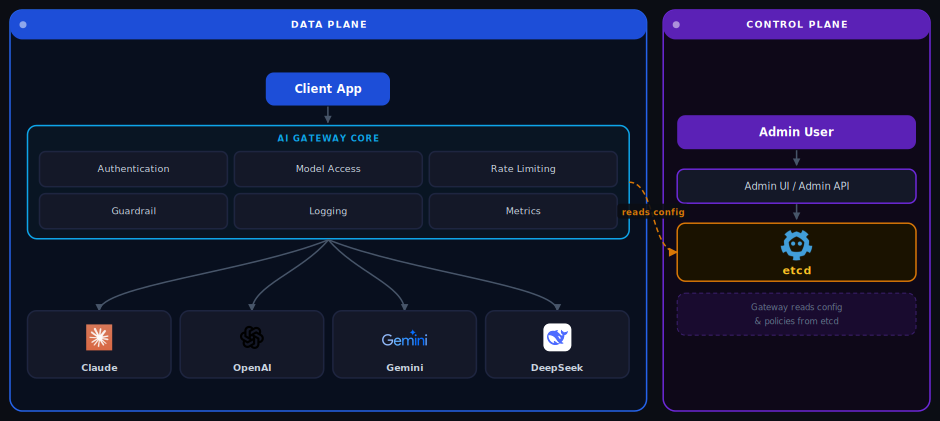

AISIX AI Gateway (hereafter AISIX) is a modern, high-performance AI gateway designed for the era of Large Language Models (LLMs). Built in Rust, it provides a robust, scalable, and flexible solution for managing, securing, and observing interactions with various LLM providers.

This document provides a high-level overview of AISIX, its architecture, and its key features.

## Why Teams Choose AISIX for Enterprise LLM Management

Integrating LLMs into products introduces challenges in managing diverse APIs, controlling costs, ensuring security, and maintaining performance. AISIX addresses these by providing a unified control plane for all AI-related traffic.

| Challenge | How AISIX Solves It |
| :--- | :--- |
| **Fragmented LLM Landscape** | Provides a unified, OpenAI-compatible API endpoint for multiple LLM providers. It supports OpenAI, Google Gemini, DeepSeek, and Anthropic out-of-the-box, abstracting away provider-specific complexities. |
| **Lack of Centralized Control** | Enables centralized management of API keys, rate limiting, and model access for fine-grained control over usage and costs. |
| **Security and Compliance Risks** | Secures LLM access with robust authentication and authorization. Its hook-based pipeline allows for easy integration of security features like content moderation or data loss prevention. |
| **Performance and Scalability** | Delivers high performance with its asynchronous Rust architecture, ensuring the gateway is not a bottleneck for high-volume, low-latency streaming applications. |
| **Complex Observability** | Integrates with OpenTelemetry for out-of-the-box tracing with Jaeger and metrics with Prometheus, providing deep insights into AI service performance. |

## Architecture

AISIX uses a decoupled architecture, separating the Control Plane (configuration management) from the Data Plane (request processing) to ensure high availability and resilience.

- **Data Plane**: A stateless, high-performance proxy built in Rust. It processes incoming AI requests through a hook-based pipeline for authentication, model validation, rate limiting, and routing. Data Plane nodes are lightweight and horizontally scalable.

- **Control Plane**: Uses **etcd** as its dynamic configuration center, managed via a dedicated **Admin API**. This allows for real-time management of API keys, models, and rate limits without service interruptions. Data Plane nodes watch for configuration changes and hot-reload them instantly. A React-based Admin Dashboard and Chat Playground are also included for easy management and testing.

Here is a diagram illustrating the basic architecture:



**Components:**

| Component | Plane | Role |
| :--- | :--- | :--- |
| **Client App** | — | Sends requests to the AISIX Proxy API (port 3000) |
| **AISIX Gateway** | Data Plane | Stateless Rust proxy that processes requests through a hook pipeline |
| **etcd** | Control Plane | Stores API keys, models, and rate limit config; watched by the gateway for hot-reload |
| **Admin API** | Control Plane | REST API for managing configuration in etcd (port 3001) |
| **Admin UI** | Control Plane | Optional React dashboard and chat playground backed by the Admin API |
| **Upstream Providers** | — | OpenAI, Google Gemini, DeepSeek, and Anthropic |

**Request Flow (Data Plane):**

```text
Client -> AISIX Gateway -> [Auth] -> [Model Validation] -> [Rate Limit] -> Upstream Provider
```

**Config Flows (Control Plane):**

```text
# Manage configuration via Admin UI:
Admin User -> Admin UI -> Admin API -> etcd <-- AISIX Gateway(watch etcd for changes)

# Manage configuration via Admin API:
Admin User ------------------------> Admin API -> etcd <-- AISIX Gateway(watch etcd for changes)
```


<br/>

This decoupled design ensures that the Data Plane continues to operate with its last known configuration even if the Control Plane is temporarily unavailable, guaranteeing uninterrupted service.

## Key Characteristics

AISIX is valued for the following characteristics:

- **High Performance**: Built in Rust, its asynchronous, non-blocking architecture ensures minimal latency, critical for real-time AI interactions.

- **Dynamic Configuration**: Configurations are managed dynamically via etcd and are hot-reloaded across the gateway cluster with no downtime.

- **Extensibility**: The hook-based system allows developers to inject custom logic into the request/response lifecycle to add functionalities like custom authentication or logging.

- **Provider Agnostic**: The provider abstraction makes it easy to add support for new LLM providers, preventing vendor lock-in.

- **Cloud-Native**: As a lightweight, stateless container, AISIX is ideal for cloud-native environments and can be easily deployed and scaled on platforms like Kubernetes.

## Related Docs

- [Quick Start](../getting-started/quick-start.md) — Deploy the AI gateway in under 5 minutes
- [Provider Abstraction](../core-concepts/provider-abstraction.md) — How AISIX routes to OpenAI, Gemini, Anthropic, and DeepSeek
- [Dynamic Configuration](../core-concepts/dynamic-configuration.md) — Hot-reload models and API keys without restarts
- [Rate Limiting](../guides/rate-limiting.md) — Control LLM costs with RPM, TPM, and concurrency limits
- [Observability](../observability.md) — OpenTelemetry tracing and Prometheus metrics for LLM traffic
