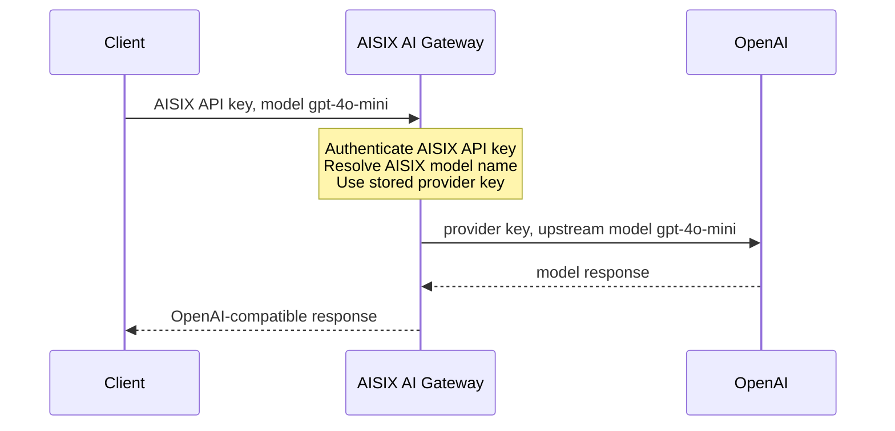

In this self-hosted quickstart, you will run AISIX AI Gateway locally, create the minimum resources needed for traffic, and send one request through the OpenAI-compatible proxy API.

AISIX AI Gateway uses etcd for self-hosted configuration storage. In this quickstart, Docker Compose starts a local etcd container and a local AISIX AI Gateway container.

This quickstart uses OpenAI as the example upstream provider. In AISIX, the client sends an AISIX API key, and the gateway uses the configured provider key when it calls the upstream provider.

The request follows this path:

<div className="aisixQuickstartDiagram">



</div>

The client sends the AISIX API key and the AISIX model name `gpt-4o-mini`. AISIX authenticates the client and uses the stored provider key to call OpenAI with the same upstream model. The client never sends the upstream OpenAI key.

## Prerequisites

* Install [Docker](https://docs.docker.com/get-docker/) with Docker Compose to start local etcd and AISIX AI Gateway containers.
* Install [cURL](https://curl.se/) to send requests to the admin and proxy APIs.
* Install [jq](https://jqlang.github.io/jq/) to read IDs from admin API responses.
* Prepare an OpenAI API key for an account with access to `gpt-4o-mini` and available quota.

## Get AISIX AI Gateway

In this section, you will create the local files and start AISIX AI Gateway with Docker Compose.

### Create a Working Directory

Create a directory for the local configuration files:

```shell
mkdir aisix-quickstart
cd aisix-quickstart
```

### Create the Local Config

Create a `config.yaml` file for the local gateway container:

```yaml title="config.yaml"
etcd:
  endpoints:
    - "http://etcd:2379"
  prefix: "/aisix"
  dial_timeout_ms: 5000
  request_timeout_ms: 5000

proxy:
  addr: "0.0.0.0:3000"

admin:
  addr: "0.0.0.0:3001"
  admin_keys:
    - "admin-local-only-change-me"

observability:
  service_name: "aisix"
  log_level: "info"

cache:
  backend: "memory"
```

### Create the Compose Stack

Create a `docker-compose.yml` file:

```yaml title="docker-compose.yml"
services:
  etcd:
    image: quay.io/coreos/etcd:v3.5.18
    command:
      - /usr/local/bin/etcd
      - --advertise-client-urls=http://etcd:2379
      - --listen-client-urls=http://0.0.0.0:2379

  aisix:
    image: ghcr.io/api7/ai-gateway:dev   # no release image is available yet
    volumes:
      - ./config.yaml:/etc/aisix/config.yaml:ro
    ports:
      - "3000:3000"
      - "3001:3001"
    depends_on:
      - etcd
```

### Start AISIX AI Gateway

Start the local stack:

```shell
docker compose up -d
```

The gateway exposes the proxy listener on `http://127.0.0.1:3000` and the admin listener on `http://127.0.0.1:3001`. Check both listeners:

```shell
curl -sS "http://127.0.0.1:3000/livez"
curl -sS "http://127.0.0.1:3001/livez"
```

Each command should return `ok`.

## Create Gateway Resources

In this section, you will create the provider key, model, and client API key that AISIX needs before it can proxy traffic.

### Export Local Variables

Export the values used by the commands in this section:

```shell
# Local admin key from config.yaml.
export AISIX_ADMIN_KEY="admin-local-only-change-me"

# Replace with your OpenAI API key.
export OPENAI_API_KEY="YOUR_OPENAI_API_KEY"

# Example AISIX API key for client requests.
export AISIX_API_KEY="sk-demo-caller"
```

### Create a Provider Key

Create a provider key that stores the OpenAI credential. The command prints the response and saves the returned ID for the next step:

```shell
PROVIDER_KEY_RESPONSE=$(curl -sS -X POST "http://127.0.0.1:3001/admin/v1/provider_keys" \
  -H "Authorization: Bearer ${AISIX_ADMIN_KEY}" \
  -H "Content-Type: application/json" \
  -d '{
    "display_name": "openai-upstream",
    "provider": "openai",
    "adapter": "openai",
    "secret": "'"${OPENAI_API_KEY}"'",
    "api_base": "https://api.openai.com/v1"
  }')

printf '%s\n' "${PROVIDER_KEY_RESPONSE}" | jq .
PROVIDER_KEY_ID=$(jq -r '.id // empty' <<< "${PROVIDER_KEY_RESPONSE}")
```

For more information about provider, adapter, and base URL settings, see [Provider Keys](../configuration/provider-keys.md).

### Create a Model

This resource connects the client-facing AISIX model name to the upstream OpenAI model. In this example, both names are `gpt-4o-mini`.

```shell
curl -sS -X POST "http://127.0.0.1:3001/admin/v1/models" \
  -H "Authorization: Bearer ${AISIX_ADMIN_KEY}" \
  -H "Content-Type: application/json" \
  -d '{
    "display_name": "gpt-4o-mini",
    "provider": "openai",
    "model_name": "gpt-4o-mini",
    "provider_key_id": "'"${PROVIDER_KEY_ID}"'"
  }'
```

Clients use `gpt-4o-mini` as the `model` value on the proxy API. The upstream provider receives the same model name.

### Create a Client API Key

AISIX stores only the SHA-256 hash of the client API key. Create the hash before writing the API key resource:

```shell
AISIX_API_KEY_HASH=$(printf '%s' "${AISIX_API_KEY}" | shasum -a 256 | awk '{print $1}')
```

Then create the API key resource that allows the AISIX API key to use `gpt-4o-mini`:

```shell
curl -sS -X POST "http://127.0.0.1:3001/admin/v1/apikeys" \
  -H "Authorization: Bearer ${AISIX_ADMIN_KEY}" \
  -H "Content-Type: application/json" \
  -d '{
    "key_hash": "'"${AISIX_API_KEY_HASH}"'",
    "allowed_models": ["gpt-4o-mini"]
  }'
```

The model and API key commands should return JSON objects with `id` values. If `PROVIDER_KEY_ID` is empty, or if a response includes `error_msg`, fix that error before continuing.

## Verify Traffic

The proxy reads gateway resources after they are written to etcd. List the models visible to the AISIX API key:

```shell
curl -sS "http://127.0.0.1:3000/v1/models" \
  -H "Authorization: Bearer ${AISIX_API_KEY}" \
  | jq -r '.data[].id'
```

The output should include `gpt-4o-mini`. Now the gateway is running and the proxy can see the configured model.

Send a request to the gateway:

```shell
curl -sS -X POST "http://127.0.0.1:3000/v1/chat/completions" \
  -H "Authorization: Bearer ${AISIX_API_KEY}" \
  -H "Content-Type: application/json" \
  -d '{
    "model": "gpt-4o-mini",
    "messages": [
      {"role": "user", "content": "Say hello from AISIX AI Gateway."}
    ]
  }'
```

You should receive an OpenAI chat-completions response similar to the following:

```json
{
  "id": "chatcmpl-DnHR8vV2AmxQioGhIXRVvEGcf22hC",
  "object": "chat.completion",
  "created": **********,
  "model": "gpt-4o-mini",
  "choices": [
    {
      "index": 0,
      "message": {
        "role": "assistant",
        "content": "Hello from AISIX AI Gateway! How can I assist you today?"
      },
      "finish_reason": "stop"
    }
  ],
  "usage": {
    "prompt_tokens": 15,
    "completion_tokens": 14,
    "total_tokens": 29
  }
}
```

## Next Steps

You have now set up a local gateway, an AISIX API key, and an AISIX model name for sending provider-backed requests through AISIX. From here, continue with [Understand Admin Resources](first-model-first-key-first-request.md) to inspect the resource chain, propagation behavior, auth checks, and cleanup flow.

To call the same gateway from application code, use the [OpenAI SDK Quickstart](openai-sdk.md) or [Anthropic SDK Quickstart](anthropic-sdk.md).
