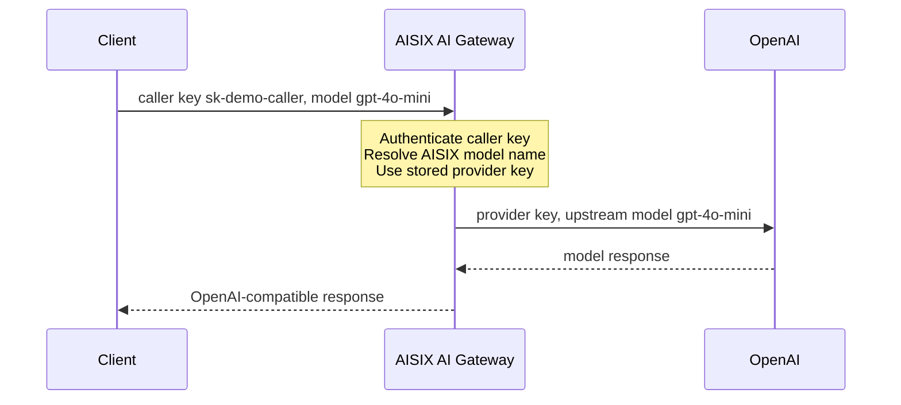

In this quickstart, you will run AISIX AI Gateway locally, create the minimum
resources needed for traffic, and send one request through the
OpenAI-compatible proxy API.

AISIX AI Gateway uses etcd for self-hosted configuration storage. In this
guide, Docker Compose starts a local etcd container and a local AISIX AI
Gateway container.

The request you build in this guide follows this path:

<div className="aisixQuickstartDiagram">



</div>

The client sends the gateway-issued caller key and the AISIX model name
`gpt-4o-mini`. AISIX authenticates the caller and uses the stored provider key
to call OpenAI with the same upstream model. The caller never sends the
upstream provider key.

## Prerequisite(s)

* Install [Docker](https://docs.docker.com/get-docker/) with Docker Compose to
  start local **etcd** and **AISIX AI Gateway** containers.
* Install [cURL](https://curl.se/) to send requests to the admin and proxy
  APIs.
* Install [jq](https://jqlang.github.io/jq/) to read IDs from admin API
  responses.
* Prepare an OpenAI API key. You need this key to complete the final proxy
  request to OpenAI.

## Get AISIX AI Gateway

### Create a Working Directory

```shell
mkdir aisix-quickstart
cd aisix-quickstart
```

### Create the Local Config

Create a `config.yaml` file for the local gateway container:

```yaml title="config.yaml"
etcd:
  endpoints:
    - "http://etcd:2379"
  prefix: "/aisix"
  dial_timeout_ms: 5000
  request_timeout_ms: 5000

proxy:
  addr: "0.0.0.0:3000"
  request_body_limit_bytes: 10485760

admin:
  addr: "0.0.0.0:3001"
  admin_keys:
    - "admin-local-only-change-me"

observability:
  service_name: "aisix"
  log_level: "info"
  access_log: true

cache:
  backend: "memory"
```

### Create the Compose Stack

Create a `docker-compose.yml` file:

```yaml title="docker-compose.yml"
services:
  etcd:
    image: quay.io/coreos/etcd:v3.5.18
    command:
      - /usr/local/bin/etcd
      - --advertise-client-urls=http://0.0.0.0:2379
      - --listen-client-urls=http://0.0.0.0:2379
    ports:
      - "2379:2379"

  aisix:
    image: ghcr.io/api7/ai-gateway:dev
    volumes:
      - ./config.yaml:/etc/aisix/config.yaml:ro
    ports:
      - "3000:3000"
      - "3001:3001"
    depends_on:
      - etcd
```

:::note
`ghcr.io/api7/ai-gateway:dev` tracks the `main` branch. For a reproducible
deployment, pin a released version tag once one is available.
:::

### Start AISIX AI Gateway

```shell
docker compose up -d
```

Check that both containers are running:

```shell
docker compose ps
```

When the stack is running, the gateway exposes the proxy listener on
`http://127.0.0.1:3000` and the admin listener on `http://127.0.0.1:3001`.

## Verify Installation

In a new terminal, check that the proxy listener is healthy:

```shell
curl -sS http://127.0.0.1:3000/livez
```

You should see:

```text
ok
```

Then check that the admin listener is healthy:

```shell
curl -sS http://127.0.0.1:3001/livez
```

You should see:

```text
ok
```

AISIX AI Gateway is now installed and running locally. Next, create the
resources that let the proxy send a real provider-backed request.

## Create the First Resources

### Export Local Variables

Export the values used by the commands in this section:

```shell
export AISIX_ADMIN_KEY="admin-local-only-change-me"
export OPENAI_API_KEY="YOUR_OPENAI_API_KEY"
export CALLER_KEY="sk-demo-caller"
```

Replace `YOUR_OPENAI_API_KEY` with a real upstream key. Without a valid
provider credential, the admin resources can still be created, but the final
proxy request will fail when AISIX calls the upstream provider.

Next, you will create three resources: a **provider key** for the upstream
credential, an **AISIX model name** that callers use on the proxy API, and a
**caller API key** that authenticates client traffic to AISIX.

### Create a Provider Key

```shell
PROVIDER_KEY_ID=$(curl -sS -X POST http://127.0.0.1:3001/admin/v1/provider_keys \
  -H "Authorization: Bearer ${AISIX_ADMIN_KEY}" \
  -H "Content-Type: application/json" \
  -d '{
    "display_name": "openai-upstream",
    "provider": "openai",
    "adapter": "openai",
    "secret": "'"${OPENAI_API_KEY}"'",
    "api_base": "https://api.openai.com/v1"
  }' | jq -r .id)
```

This stores the upstream credential AISIX uses when it forwards requests to
OpenAI. The command also captures the returned resource ID in
`PROVIDER_KEY_ID`.

:::warning Production Credentials
In standalone self-hosted mode, AISIX stores provider-key `secret` values as
plaintext under the configured etcd `prefix`. For production, protect etcd with
the same care as any secret store, including encryption at rest and restricted
access. In AISIX Cloud managed deployments, provider credentials are managed by
the control plane and projected to data planes.
:::

:::note Provider Base URL
This quickstart uses OpenAI, so `api_base` is `https://api.openai.com/v1`. Do
not reuse that value for every provider. Provider base URL requirements differ;
see [Provider Keys](../configuration/provider-keys.md#configure-the-base-url)
and
[Base URL Normalization](../configuration/provider-keys.md#base-url-normalization).
:::

### Create a Model

This resource connects the caller-facing AISIX model name to the upstream
OpenAI model. In this first example, both names are `gpt-4o-mini`.

```shell
MODEL_ID=$(curl -sS -X POST http://127.0.0.1:3001/admin/v1/models \
  -H "Authorization: Bearer ${AISIX_ADMIN_KEY}" \
  -H "Content-Type: application/json" \
  -d '{
    "display_name": "gpt-4o-mini",
    "provider": "openai",
    "model_name": "gpt-4o-mini",
    "provider_key_id": "'"${PROVIDER_KEY_ID}"'"
  }' | jq -r .id)
```

Clients use `gpt-4o-mini` as the `model` value on the proxy API. The upstream
provider receives the same model name.

### Create a Caller API Key

AISIX stores a hash of the caller key rather than the plaintext value. Hash the
caller key first:

```shell
if command -v sha256sum >/dev/null 2>&1; then
  CALLER_KEY_HASH=$(printf '%s' "${CALLER_KEY}" | sha256sum | cut -d' ' -f1)
else
  CALLER_KEY_HASH=$(printf '%s' "${CALLER_KEY}" | shasum -a 256 | awk '{print $1}')
fi
```

Then create the API key resource that allows the caller key to use
`gpt-4o-mini`:

```shell
APIKEY_ID=$(curl -sS -X POST http://127.0.0.1:3001/admin/v1/apikeys \
  -H "Authorization: Bearer ${AISIX_ADMIN_KEY}" \
  -H "Content-Type: application/json" \
  -d '{
    "key_hash": "'"${CALLER_KEY_HASH}"'",
    "allowed_models": ["gpt-4o-mini"]
  }' | jq -r .id)
```

Verify that all three resource IDs were captured:

```shell
printf 'provider key: %s\nmodel: %s\napi key: %s\n' \
  "${PROVIDER_KEY_ID}" "${MODEL_ID}" "${APIKEY_ID}"
```

If any value is empty or `null`, check the previous command output for
`error_msg` before continuing.

## Verify Traffic

### Verify Model Visibility

Admin API writes land in etcd first, and the proxy applies those changes
asynchronously. Give the proxy a moment to receive the new resources before you
send traffic.

Poll `/v1/models` until the AISIX model name is visible to the caller key:

```shell
MODEL_VISIBLE=false
for i in $(seq 1 20); do
  if curl -sS http://127.0.0.1:3000/v1/models \
    -H "Authorization: Bearer ${CALLER_KEY}" \
    | jq -e '.data[]? | select(.id == "gpt-4o-mini")' >/dev/null; then
    MODEL_VISIBLE=true
    echo "model is visible"
    break
  fi
  sleep 0.5
done

if [ "${MODEL_VISIBLE}" != "true" ]; then
  echo "model is not visible yet; check the admin resources and proxy logs" >&2
fi
```

You can also inspect the caller-visible model list:

```shell
curl -sS http://127.0.0.1:3000/v1/models \
  -H "Authorization: Bearer ${CALLER_KEY}"
```

The response should include `gpt-4o-mini`.

When `gpt-4o-mini` appears, the gateway is running and the proxy can see the
configured model. `/v1/models` confirms caller authentication, model
allowlisting, and configuration propagation. The next request sends traffic
through the provider key to the upstream provider.

### Send a Proxy Request

```shell
curl -sS -X POST http://127.0.0.1:3000/v1/chat/completions \
  -H "Authorization: Bearer ${CALLER_KEY}" \
  -H "Content-Type: application/json" \
  -d '{
    "model": "gpt-4o-mini",
    "messages": [
      {"role": "user", "content": "Say hello from AISIX AI Gateway."}
    ]
  }'
```

With a valid upstream provider key, you should receive an OpenAI
chat-completions response that includes the model `gpt-4o-mini`.

The gateway authenticates to the upstream provider with the provider key you
created earlier, while the caller authenticates to AISIX with the caller API
key. This separation is one of the core operating patterns in AISIX AI Gateway.

You can now reuse this local gateway, caller key, and AISIX model name in the
SDK quickstarts.

## Next Steps

Continue with
[Understand Admin Resources](first-model-first-key-first-request.md) to inspect
the resource chain, propagation behavior, auth checks, and cleanup flow. To call
the same gateway from application code, run the
[OpenAI SDK Quickstart](openai-sdk.md) or
[Anthropic SDK Quickstart](anthropic-sdk.md).
