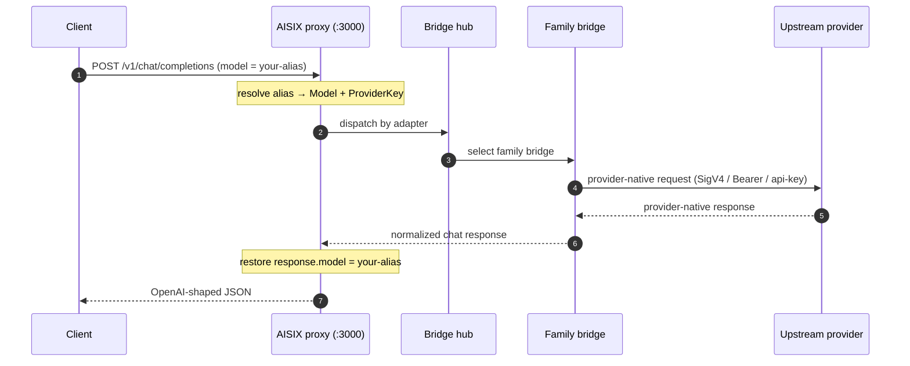

An **adapter** is the upstream wire shape AISIX AI Gateway encodes a request into when it dispatches to a provider. The gateway knows a closed set of five adapter protocol families. Every upstream — whether it comes from the curated catalog or you bring your own endpoint — resolves to exactly one of them.

This page explains the five families, how a model resolves to a bridge at request time, and how the catalog and bring-your-own (BYO) modes select an adapter. Use it to decide which integration guide to follow and what credential shape a given upstream needs.

## The five adapter families

The adapter set is fixed in code as a closed enum (`Adapter` in `aisix-core`). It serializes in `kebab-case`, so the Azure family is the wire string `azure-openai`.

| Adapter | Wire shape | Bridge crate | Auth | Integration guide |
|---|---|---|---|---|
| `openai` | OpenAI chat completions (`POST /chat/completions`) | `aisix-provider-openai` | `Authorization: Bearer` (`api-key` reuse for OpenAI-compatible vendors) | [OpenAI-compatible API](../integration/openai-compatible-api.md), [BYO endpoint](../configuration/byo-endpoint.md) |
| `anthropic` | Anthropic Messages (`POST /v1/messages`) | `aisix-provider-anthropic` | `x-api-key` + `anthropic-version` | [Anthropic Messages](../integration/anthropic-messages.md) |
| `bedrock` | AWS Bedrock Runtime — Converse (`/converse`) and the Anthropic `/invoke` route | `aisix-provider-bedrock` | AWS SigV4 | [AWS Bedrock upstream](../integration/upstream-bedrock.md) |
| `vertex` | Google Vertex AI Gemini (`:generateContent`) | `aisix-provider-vertex` | OAuth2 Bearer (GCP) | [Google Vertex AI upstream](../integration/upstream-vertex.md) |
| `azure-openai` | Azure OpenAI Service (`/openai/deployments/<deployment>/chat/completions`) | `aisix-provider-azure-openai` | `api-key` header **or** Entra ID (AAD) Bearer | [Azure OpenAI upstream](../integration/upstream-azure-openai.md) |

The `openai` family is the broadest. Besides OpenAI itself, every OpenAI-compatible catalog vendor (DeepSeek, Groq, Mistral, Together.ai, Fireworks, Perplexity, and others) and every BYO OpenAI-compatible endpoint (vLLM, SGLang, Ollama, a self-hosted proxy) dispatches through the same OpenAI bridge — they differ only in `api_base` and credential.

## Specialized bridges, not one generic client

Each adapter family is a distinct `Bridge` implementation. The gateway does not normalize every provider into one OpenAI-shaped HTTP call. Instead, a per-family bridge owns the request encoding, the auth scheme, the URL construction, and the response decoding for that upstream's native protocol:

- The **OpenAI** and **Azure OpenAI** bridges speak the OpenAI chat-completions wire. Azure differs on the URL pattern (deployment-keyed), the auth header (`api-key` instead of `Authorization`), and tolerance for Azure's `prompt_filter_results` / `content_filter_results` response extensions.
- The **Anthropic** bridge speaks the Anthropic Messages wire and translates Anthropic-shaped requests bidirectionally for non-Anthropic upstreams (see [Anthropic Messages](../integration/anthropic-messages.md)).
- The **Bedrock** bridge dispatches through the AWS SDK with SigV4 signing. Anthropic-on-Bedrock models use the legacy `/invoke` route with an Anthropic Messages body; all other publishers use the unified Converse API.
- The **Vertex** bridge builds Gemini's `:generateContent` request body and mints a GCP OAuth2 token from the service-account credential before each call.

Whatever the upstream protocol, the customer-facing contract stays OpenAI-shaped: the response is rendered back as an OpenAI chat-completions envelope, and `response.model` echoes your model alias rather than the upstream id. That alias restore is gateway-wide and applies identically across all five families.

## How a model resolves to a bridge

A direct [model](../configuration/models.md) references a [provider key](../configuration/provider-keys.md) by `provider_key_id`. At dispatch time the gateway selects the bridge from the provider key in two tiers:

1. **Specialized vendor lookup** — keyed on the provider key's `provider` (vendor identity). Only `openai` and `anthropic` are registered as specialized vendors today; this tier mainly serves pre-existing keys.
2. **Adapter family lookup** — keyed on the provider key's `adapter` field. This is how `bedrock`, `vertex`, and `azure-openai` keys reach their bridge, and how any OpenAI-compatible vendor reaches the OpenAI bridge.

For the three specialized upstreams (Bedrock, Vertex, Azure OpenAI), set `adapter` on the provider key to `bedrock`, `vertex`, or `azure-openai`. The bridge then reads the model's `model_name` as the upstream id (Bedrock model id, Vertex publisher model, or Azure deployment name) and the provider key's `secret` / `api_base` for credentials and endpoint.

:::note
The `adapter` field is the dispatch key for the specialized families. The `model_name` on a model is always the **upstream** identifier; the customer-facing alias is the model's `display_name`, which is what the caller sends in `model` and what `response.model` echoes back.
:::

## Catalog versus bring-your-own

A provider key's telemetry tags carry a `kind` of either `catalog` or `byo` (the `telemetry_tags.kind` field). The two modes choose an adapter differently:

- **Catalog** — the upstream comes from a curated, models.dev-driven catalog. In AISIX Cloud, the control plane maps each catalog provider to its adapter automatically (for example, `amazon-bedrock` → `bedrock`, `azure` → `azure-openai`, `google-vertex` → `vertex`, `deepseek` → `openai`). You select a provider; the adapter is implied.
- **Bring-your-own (BYO)** — the upstream is a private or self-hosted endpoint that is not in the catalog. You set the adapter explicitly. In the self-hosted gateway you set `provider` + `api_base` (and, for the specialized families, `adapter`) directly on the provider key through the admin API. In AISIX Cloud, BYO endpoints are admitted through a BYO path that lets you pick one of the five adapters for the endpoint.

### Featured versus non-featured catalog providers

Within the catalog, a subset of providers is **featured** — the curated, ranked set the dashboard surfaces first (OpenAI, Anthropic, Amazon Bedrock, Azure, Google Vertex, DeepSeek, and others). Non-featured catalog providers still resolve to an adapter through the same catalog mapping; they are simply not promoted in the dashboard's ranked list. Featured status affects discovery and presentation, not dispatch — both featured and non-featured providers run through the same five bridges.

:::note Self-hosted versus Cloud
The catalog mapping and the featured ranking are AISIX Cloud control-plane behavior. The self-hosted gateway does not ship a catalog: you set `provider`, `api_base`, and `adapter` on each provider key yourself. The dispatch tiers above are identical in both modes — only the source of the field values differs.
:::

## Current capability per family

Each integration guide documents the exact current behavior, including per-family limitations. In summary:

- **Bedrock** — chat is wired for Anthropic (Claude on Bedrock, via `/invoke`) and for all other publishers through the Converse API. Cross-region inference profile prefixes (`us.`, `eu.`, `apac.`, `global.`, `us-gov.`) are supported.
- **Vertex** — Gemini chat and streaming are wired. Anthropic-on-Vertex and Llama-on-Vertex are not yet implemented; see [Google Vertex AI upstream § Limitations](../integration/upstream-vertex.md#limitations) and the [Roadmap](../roadmap.md).
- **Azure OpenAI** — chat and streaming are wired for both the `api-key` and the Entra ID (AAD) `client_credentials` auth schemes.

## Related pages

- [Provider keys](../configuration/provider-keys.md) — the credential resource every adapter dispatch reads from.
- [Provider compatibility](provider-compatibility.md) — the current provider set and per-endpoint support boundaries.
- [BYO endpoint](../configuration/byo-endpoint.md) — point the OpenAI adapter at a private or self-hosted endpoint.
- [AWS Bedrock upstream](../integration/upstream-bedrock.md), [Google Vertex AI upstream](../integration/upstream-vertex.md), [Azure OpenAI upstream](../integration/upstream-azure-openai.md) — the three specialized-family guides.
