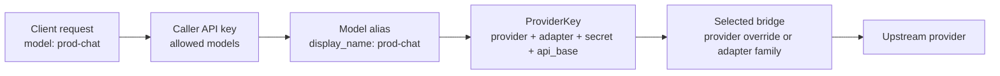

An **adapter** is the upstream protocol family AISIX uses after it resolves a
caller-facing model alias to a provider key.

This reference explains how one model alias can dispatch to OpenAI,
Anthropic, Bedrock, Vertex AI, Azure OpenAI, or an OpenAI-compatible endpoint
without changing the caller-facing API.

For endpoint-by-endpoint support, see [Provider compatibility](provider-compatibility.md).

## Choose the right adapter

Choose the adapter that matches the upstream wire shape, not the marketing name
of the provider.

| If the upstream speaks | Use `adapter` | Common examples |
| --- | --- | --- |
| OpenAI-compatible chat-completions | `openai` | OpenAI, DeepSeek, Groq, Mistral, Together.ai, Fireworks, Perplexity, vLLM, SGLang, Ollama, private OpenAI-compatible endpoints |
| Anthropic Messages | `anthropic` | Anthropic native Messages API |
| AWS Bedrock Runtime | `bedrock` | Anthropic Claude on Bedrock, Bedrock Converse publishers |
| Google Vertex AI publisher routes | `vertex` | Gemini, Anthropic Claude on Vertex, Vertex MaaS publisher rails |
| Azure OpenAI Service | `azure-openai` | Azure OpenAI deployments with API-key or Entra ID authentication |

If a provider exposes an OpenAI-compatible API, it usually uses
`adapter: "openai"` even when its `provider` value is not `openai`. For
example, a DeepSeek provider key can use `provider: "deepseek"` and
`adapter: "openai"`.

## Understand each adapter family

### `openai`

Uses the OpenAI chat-completions wire shape.

This is the broadest family. It covers OpenAI itself, public
OpenAI-compatible providers, and private OpenAI-compatible endpoints.
Authentication usually uses `Authorization: Bearer`, although some compatible
providers use provider-specific credential headers behind the same family.

See [OpenAI-compatible API](../integration/openai-compatible-api.md),
[OpenAI-compatible vendor upstream](../integration/upstream-openai-compat.md),
and [Bring your own endpoint](../configuration/byo-endpoint.md).

### `anthropic`

Uses the Anthropic Messages wire shape.

Authentication uses `x-api-key` and `anthropic-version`. Use this family when
the upstream provider is Anthropic-native, not merely when the caller sends an
Anthropic-style request to AISIX.

See [Anthropic Messages](../integration/anthropic-messages.md).

### `bedrock`

Uses AWS Bedrock Runtime.

AISIX signs outbound requests with AWS SigV4. Anthropic Claude on Bedrock uses
the Bedrock `/invoke` path with an Anthropic Messages body. Other supported
publishers use Bedrock Converse.

See [AWS Bedrock upstream](../integration/upstream-bedrock.md).

### `vertex`

Uses Google Vertex AI publisher routes.

AISIX authenticates with a GCP OAuth2 Bearer token, either minted from a
service-account credential or supplied as a pre-minted token. The bridge then
routes to publisher-specific Vertex paths such as `:generateContent`,
`:rawPredict`, or OpenAI-compatible MaaS endpoints.

See [Google Vertex AI upstream](../integration/upstream-vertex.md).

### `azure-openai`

Uses Azure OpenAI Service deployment routes.

AISIX builds Azure URLs from the provider key's resource host and the model's
upstream deployment name. Authentication uses either Azure's `api-key` header or
an Entra ID Bearer token.

See [Azure OpenAI upstream](../integration/upstream-azure-openai.md).

## Keep `provider` and `adapter` separate

`provider` identifies the upstream vendor or endpoint. It is an open string,
such as `openai`, `anthropic`, `deepseek`, `amazon-bedrock`, `google-vertex`,
`azure`, or an internal endpoint label.

`adapter` identifies the protocol family AISIX knows how to encode. It is the
closed set listed above.

This distinction lets AISIX support long-tail providers without changing the
data plane for every new vendor. A new OpenAI-compatible provider can keep its
own provider identity, base URL, telemetry metadata, and model IDs while still
using the OpenAI adapter family.

For the generated provider-key contract, see
[Provider key schema](provider-key-schema.md).

## How dispatch works

A direct [model](../configuration/models.md) references a
[provider key](../configuration/provider-keys.md) through `provider_key_id`.
When a request reaches AISIX, dispatch follows this shape:

1. The caller sends a gateway API key and a model alias.
2. AISIX authenticates the caller and checks that the key can use the alias.
3. AISIX resolves the alias to a model and its provider key.
4. AISIX first looks for a provider-specific bridge keyed by the provider key's
   `provider`.
5. If no provider-specific bridge matches, AISIX falls back to the bridge for
   the provider key's `adapter`.
6. The selected bridge builds the provider-native request and renders the
   caller-facing response.

Only `openai` and `anthropic` are registered as provider-specific bridges
today, mainly to keep older provider-key rows routable during upgrade. The
adapter-family tier is the normal path for Bedrock, Vertex AI, Azure OpenAI,
and OpenAI-compatible providers whose provider value is not `openai`.

:::note
The caller-facing model name is the model's `display_name`. The upstream model
ID is the model's `model_name`. For normalized chat responses,
`response.model` echoes the caller-facing alias, not the upstream model ID.
:::

## Cloud catalog and self-hosted providers

In AISIX Cloud, the control plane maps catalog providers to adapter families and
projects provider keys to the data plane. Operators select the provider in the
managed workflow; the adapter and base URL are populated by the control plane.

In self-hosted deployments, you set `provider`, `adapter`, `api_base`, and
`secret` directly on each provider key.

Featured or community catalog status affects dashboard presentation. It does
not change data-plane dispatch. Dispatch depends on the resolved model,
provider key, provider identity, adapter, and connection settings.

## Capability boundaries

Adapters describe the upstream protocol family. They do not guarantee that
every proxy endpoint supports every provider.

For example:

- `/v1/chat/completions` is the broadest normalized chat path.
- `/v1/responses` and `/v1/images/generations` are OpenAI-provider paths, not
  generic `openai` adapter paths.
- `/v1/rerank` is keyed by provider labels such as `openai`, `cohere`, and
  `jina` and bypasses normal chat-bridge dispatch.
- `/passthrough/:provider/*rest` borrows a configured provider key and performs
  less gateway normalization.

Use [Provider compatibility](provider-compatibility.md) before depending on a
specific provider and endpoint combination.

## Next steps

- [Provider keys](../configuration/provider-keys.md) explains how to configure
  credentials, base URLs, providers, and adapters.
- [Provider compatibility](provider-compatibility.md) explains endpoint support
  boundaries.
- [Bring your own endpoint](../configuration/byo-endpoint.md) points the
  `openai` adapter at a private or self-hosted endpoint.
- [AWS Bedrock upstream](../integration/upstream-bedrock.md), [Google Vertex AI upstream](../integration/upstream-vertex.md), and [Azure OpenAI upstream](../integration/upstream-azure-openai.md) cover specialized provider families.
